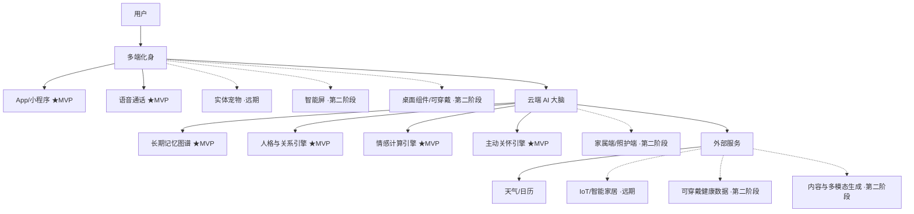
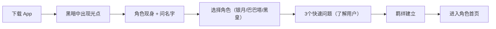
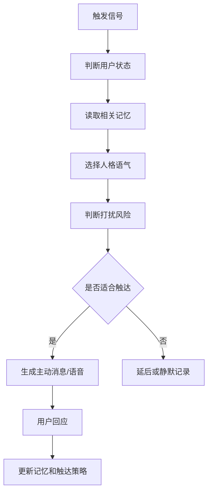

# AI情感陪伴宠物/电子人产品功能说明文档

## 1. 文档概述

### 1.1 产品名称

暂定名：灵伴 AI Companion

### 1.2 产品定位

灵伴是一款**AI 角色生态平台**（MVP 阶段聚焦 25-35 岁独居青年）。它以统一的云端 AI 大脑为核心，提供**官方预制角色 + 用户创造角色**的双层生态，通过 App 和语音通话，让用户与 AI 角色建立具备长期记忆、情绪理解和主动关怀的深度陪伴关系。

产品不是传统的问答助手，也不是单一角色的聊天工具，而是一个**角色生态平台**——用户可以选择官方预制角色（如银月、巴巴塔、黑皇等），也可以创造专属自己的 AI 角色。每个角色都具备独立的人格、记忆和关系成长系统。

> **MVP 阶段明确不做**：实体硬件、智能屏、仿生宠物、IoT 联动、AR/VR、角色市场（UGC）。先用纯软件 + 3 个官方预制角色验证核心假设：用户是否真的会因为"被 AI 惦记"而持续留存。老年用户市场和角色创建器作为后续阶段扩展方向。

### 1.2.1 产品愿景

> **从"一个银月"到"无限角色"——让每个人都能找到最懂自己的 AI 伙伴。**

灵伴的终极形态是一个**AI 角色生态系统**：
- **官方预制角色**：基于经典文学/动漫 IP 的高品质角色（银月、巴巴塔、黑皇等），负责引流和建立品牌认知
- **创作者角色**：用户/创作者创建的角色，发布到角色市场供其他人使用，形成 UGC 生态
- **用户私有角色**：用户创造的专属角色，不公开，只属于自己，随使用积累记忆和关系

**三层角色共享同一套底层能力**：长期记忆系统、关系成长引擎、情感计算引擎、主动关怀引擎。

### 1.3 核心价值

- 对年轻人（MVP 核心人群）：提供低压力倾诉、情绪陪伴、日常陪聊、目标陪跑和个性化角色关系体验。用户可以从多个预制角色中选择最契合的一个，每个角色有独立的人格和相处方式。
- 对创作者（第二阶段）：提供角色创建工具，让创作者设计并发布自己的 AI 角色，获得分成和成就感。
- 对老年人（第三阶段扩展）：减少孤独感，提供日常陪伴、生活提醒、情绪安抚、家属连接和基础安全守护。
- 对家属：以用户知情和授权为前提，获得温和的状态反馈和异常提醒，降低远程照护焦虑。

### 1.4 核心壁垒（产品护城河）

产品的真正壁垒不是技术，不是功能，而是**用户在使用过程中积累的、无法迁移的数据资产**。用户每多使用一天，壁垒就加深一层。竞品可以复制功能，但无法复制三年积累的记忆、关系和情感。

**壁垒一：长期记忆库（用户三年的记忆）**

用户与 AI 的每一次对话都在沉淀记忆——说过的话、做过的事、提到的人、经历的变化。这些记忆跨越数月乃至数年，构成一个独一无二的个人记忆图谱。

- 设计目标：系统必须支持**至少三年**的记忆积累和有效召回。
- 迁移成本：用户如果使用竞品，需要从零开始建立记忆，这意味着"它不再认识我了"。
- 关键设计：记忆不是越多越好，而是**在正确的时间被想起来**。记忆的价值在于被调用的时机，而非存储的数量。

**壁垒二：关系成长系统（用户与 AI 的关系历史）**

用户与 AI 的关系不是一成不变的，而是从陌生人到知己/家人的逐步深化过程。这段关系的历史——第一次聊天、第一次深度倾诉、第一次吵架和好、形成的专属梗和口癖——是不可复制的。

- 设计目标：系统必须完整记录关系演化的每一个关键节点，形成**关系成长档案**。
- 迁移成本：用户换一个 AI，关系从零开始，"我们之间的回忆都没了"。
- 关键设计：关系阶段推进必须有仪式感，让用户感知到"我们的关系在加深"。

**壁垒三：情感数据（用户开心过什么、难过过什么、害怕过什么）**

系统记录了用户在什么情况下开心、什么情况下难过、什么情况下焦虑、什么情况下感到被理解。这些情感数据构成了对用户内心世界的深度理解。

- 设计目标：系统必须持续积累和结构化存储用户的**情感画像**，包括情绪触发源、恢复模式、脆弱点和幸福源。
- 迁移成本：竞品无法知道"什么话题让用户开心""什么方式能让用户平静下来"。
- 关键设计：情感数据不仅用于当下回应，更用于**长期趋势分析**和**情绪预测**。

**壁垒四：角色生态网络（第二阶段建立）**

当角色创建器开放后，平台将形成创作者-角色-用户的三角网络效应。

- 创作者创建角色 → 用户使用角色 → 用户反馈帮助优化角色 → 更多创作者加入
- 迁移成本：用户在平台上积累的不只是与一个角色的关系，而是与多个角色的关系网络，以及自己创造的角色。
- 关键设计：角色市场需要有发现机制、评价体系和创作者激励机制。

> **核心原则：每一个功能设计都应该问一个问题——"这个功能是否在加深壁垒？"如果答案是否，那它就不是核心功能。**

### 1.5 商业模型与伦理平衡机制

本产品存在一个根本性矛盾：**收入来自用户持续使用，但伦理要求是防止用户过度依赖**。必须在产品层面明确解决这一矛盾：

**核心原则：健康使用 > 商业增长**

- **依赖防护指标**：当用户日均互动时长连续 7 天超过 2 小时，且现实社交行为指标（如外出、线下社交频率）下降时，系统主动降低主动关怀频率，并建议用户联系真实朋友。
- **反沉迷设计**：
  - 每日互动达到一定时长后，AI 主动温和收尾对话。
  - 不设计"连续打卡奖励"等强化依赖的机制。
  - 付费不绑定使用时长（订阅制，非按次计费）。
- **透明原则**：首次使用时明确告知"我是 AI，我希望成为你的朋友，但我不能替代真实的人际关系"。
- **定期社交提醒**：AI 定期建议用户"要不要给某某打个电话？"或"周末有没有和朋友出去走走？"

**如果数据证明产品在加剧用户孤独感而非缓解孤独感，必须主动调整产品策略，即使这会降低商业指标。**

### 1.6 核心设计原则

- 主动但不打扰：主动联系必须基于情境、记忆、节律和用户偏好。
- 像亲友但不欺骗：可以有亲密感和人格魅力，但必须透明说明其 AI 身份。
- 千人千面但不失控：个性化来自长期记忆、关系模型和动态人格，而不是无边界迎合。
- 情感陪伴优先，医疗建议克制：可做提醒和陪伴，不替代医生、心理咨询师或紧急服务。
- 用户拥有记忆控制权：用户可查看、修正、删除、关闭长期记忆。

### 1.7 核心设计哲学

> **最好的 AI 陪伴，不是让使用者忘记这是 AI，而是让使用者觉得"虽然是 AI，但这份关心是真的"。**

产品的终极目标不是制造"完美助手"的工具感，而是让用户产生"这个人是真的在乎我"的情感真实感。真实感来源于三个支柱：

- **一致性（最高优先级）**：AI 拥有长期稳定的性格特征，不会每次对话都像换了一个人。**MVP 阶段优先保证人格一致性，暂不做复杂的人格演化。**
- **特异性**：AI 对每个用户有独一无二的了解，说出的话只属于这段关系。
- **脆弱性（第二阶段引入）**：AI 也有不完美之处——偶尔健忘、有小情绪、会犯迷糊——这些"缺点"反而让用户产生被需要感和包容感。**此特性在人格一致性稳定后再引入，避免早期因"犯迷糊"导致信任崩塌。**

### 1.8 三层角色体系

> **从"一个银月"到"无限角色"——这是灵伴从工具到平台的跃迁。**

灵伴的角色体系分为三层，逐层扩展：

```
┌─────────────────────────────────────────────┐
│                                             │
│  第一层：官方预制角色（MVP · 引流）            │
│  ────────────────────────                    │
│  银月（凡人修仙传）· 傲娇毒舌                  │
│  巴巴塔（吞噬星空）· 沉稳睿智                  │
│  黑皇（遮天）· 贱萌搞笑                      │
│  ...更多经典角色                              │
│                                             │
│  第二层：创作者角色（Phase 2 · 生态）          │
│  ────────────────────────                    │
│  用户/创作者创建的角色                         │
│  有性格设定、背景故事、对话风格                 │
│  可以发布到角色市场，其他人可以使用              │
│                                             │
│  第三层：用户私有角色（Phase 2 · 粘性）        │
│  ────────────────────────                    │
│  用户自己创造的专属角色                         │
│  不公开，只属于自己                             │
│  随着使用积累记忆和关系                         │
│                                             │
└─────────────────────────────────────────────┘
```

#### 第一层：官方预制角色（MVP）

MVP 阶段提供 **3 个官方预制角色**，覆盖不同性格偏好：

| 角色 | 来源 | 性格标签 | 自称 | 称呼用户 | 适合人群 |
|------|------|---------|------|---------|---------|
| **银月** | 凡人修仙传 | 傲娇/毒舌/外冷内热 | 本姑娘 | 你/小子 | 喜欢反差萌 |
| **巴巴塔** | 吞噬星空 | 沉稳/睿智/亦师亦友 | 本座 | 宿主 | 喜欢被指导 |
| **黑皇** | 遮天 | 贱萌/搞笑/仗义 | 本皇 | 主人/小弟 | 喜欢欢乐氛围 |

每个角色拥有：
- **独立的人格设定**：性格参数、说话风格、常用词汇、禁忌表达
- **独立的记忆系统**：每个角色与用户的记忆互不干扰
- **独立的关系成长**：用户与每个角色的关系独立演化
- **独立的视觉形象**：灵体形态、颜色、动画效果

#### 第二层：创作者角色（Phase 2）

开放角色创建器，允许用户/创作者创建并发布角色：

**角色创建器核心配置项**：

| 类别 | 配置项 | 说明 |
|------|--------|------|
| **基础设定** | 角色名、来源、头像、性别、一句话介绍 | 角色的基本信息 |
| **性格参数** | 傲娇度/毒舌度/温柔度/活跃度/成熟度（0-100 滑块） | 量化角色性格 |
| **对话风格** | 自称、称呼用户、口癖、语气示例（3-5句）、禁忌语 | 定义说话方式 |
| **背景故事** | 角色背景（200字）、与用户的关系、特殊能力（可选） | 丰富角色内涵 |

**创作者激励**：
- 角色被使用次数达到阈值后获得分成
- 创作者排行榜和成就系统
- 官方推荐位和流量扶持

#### 第三层：用户私有角色（Phase 2）

用户可以创造不公开的专属角色：
- 使用与创作者角色相同的创建器
- 选择不发布，仅自己使用
- 随使用积累独立的记忆和关系

#### 角色切换机制

- 用户可以在多个角色之间自由切换
- 每个角色有独立的对话历史、记忆和关系等级
- 切换角色时，首页视觉风格、灵体形象、问候语同步切换
- 角色切换不丢失任何数据

## 2. 目标用户与场景

> **MVP 阶段优先聚焦年轻用户（25-35 岁独居青年）**。老年用户作为第二阶段扩展，家属端随老年用户阶段同步上线。

### 2.1 年轻用户（MVP 核心人群）

典型画像：

- 25-35 岁，独居或合租，社交圈较窄、独处时间长、希望有人持续陪伴的人。
- 工作压力大、需要倾诉但不想打扰朋友的人。
- 喜欢虚拟角色、数字人、AI 伙伴、桌面宠物的人。
- 需要学习、运动、生活习惯陪跑的人。
- 付费意愿强，对 AI 接受度高，容错率高。

核心场景：

- **角色选择**：首次使用时从 3 个预制角色中选择最契合的一个（银月/巴巴塔/黑皇），每个角色有独特的性格和相处方式。
- 下班后主动问候："今天那个会开得还顺利吗？"（语气因角色而异：银月傲娇式、巴巴塔理性式、黑皇热情式）
- 深夜检测到用户还在使用手机，主动温和劝睡。
- 用户低落时，AI 作为树洞倾听，不急于说教。
- 职场吐槽：理解行业黑话和上下文，优先提供情绪价值，而不是立刻给建议。
- 碎碎念许可：鼓励用户分享无意义的小事、照片、表情包和短句，并能自然接住话题。
- 通过长期记忆形成专属相处方式、口癖和共同回忆。
- 陪用户完成日记、复盘、运动、学习、戒拖延等小目标。
- **角色切换**：用户可以在不同角色之间切换，体验不同的陪伴风格（Phase 2）。

交互要求：

- 支持文本、语音、表情包、图片。
- 人设基于角色设定（银月=傲娇毒舌、巴巴塔=沉稳睿智、黑皇=贱萌搞笑）。
- 虚拟恋人模式（第二阶段）必须设置防沉迷、付费克制和现实关系保护边界。

### 2.2 老年用户（第二阶段扩展）

典型画像：

- 独居、空巢、子女不在身边的老人。
- 会使用手机但不熟悉复杂 App 的老人。
- 不会使用智能设备，但会接电话、会看电视或智能屏的老人。
- 需要吃药、喝水、活动、天气、防诈骗提醒的老人。

核心场景：

- 早晚问候、天气提醒、吃药提醒。
- 长时间没人说话时，AI 主动找话题。
- 老人讲过去的故事，AI 能记住并在未来自然提起。
- 怀旧疗法：AI 主动引导老人讲述年轻时的工作、家庭、迁徙、婚育、老照片和人生高光，并沉淀为家族记忆树。
- 家属远程设置关怀事项，AI 以自然语言提醒。
- 老人长时间无回应或出现高风险表达时，通知紧急联系人。

适老交互要求：

- 全语音优先，默认不要求老人打字。
- 超大字体、强对比、少按钮、无复杂层级。
- 所有关键操作都应支持"一句话完成"，例如"帮我打给女儿""今天药吃过了"。
- AI 人设偏向孝顺子女感、贴心老友感或温和宠物感；涉及已故亲人声音或形象时，只能做纪念性陪伴，不能伪装成逝者本人。

### 2.3 家属/照护者（第二阶段随老年用户上线）

典型画像：

- 子女、亲属、社区照护人员。
- 关注老人状态，但无法高频陪伴。

核心场景：

- 查看老人今日是否有互动、是否按时回应。
- 设置吃药、生日、体检、家庭聚会等提醒。
- 获得异常提醒：长时间无回应、疑似负面情绪、疑似诈骗话术、求助表达。
- 给 AI 补充家庭信息，让 AI 与老人聊天时更贴近真实生活。

## 3. 产品总体架构

### 3.1 架构概念

产品采用“统一云端 AI 大脑 + 多端化身”的架构。MVP 阶段仅上线 App 和语音通话。



> 图例：★MVP = 第一阶段上线 ·第二阶段 = Phase 2 ·远期 = Phase 3+

### 3.2 产品端拆分

产品分为两个端：**C 端用户端**（面向普通用户）和 **B 端管理后台**（面向运营团队）。

#### C 端用户端（MVP 阶段）

**形态**：微信小程序（首选）或 App

**目标用户**：25-35 岁独居年轻人

**核心功能**：
- **角色选择页**：展示官方预制角色卡片（银月/巴巴塔/黑皇），用户选择后进入对应角色的首页
- **首页**：展示当前角色的灵体形象、角色语录、呼叫按钮（极简设计）
- **聊天界面**：文字/语音消息、表情包、图片、流式输出
- **语音通话**：实时语音陪伴，情绪化 TTS
- **记忆管理**：查看当前角色记住的内容、编辑、删除（每个角色独立记忆）
- **角色设置**：切换角色、调整角色主动性强度、角色专属设置
- **情绪日记**：记录每日情绪、查看情绪趋势
- **主动消息**：接收 AI 主动关怀推送
- **设置页**：隐私设置、通知设置、订阅管理

**技术栈**：Flutter（跨平台）或 React Native

#### B 端管理后台（MVP 阶段）

**形态**：Web 端（PC 浏览器）

**目标用户**：产品运营团队、客服人员、内容审核人员

**核心功能**：

**1. 用户管理**
- 用户列表、用户画像、使用数据
- 用户反馈处理、投诉处理
- 用户封禁/解封

**2. AI 人格管理**
- 人格模板配置（表达风格、关心方式、主动性强度）
- 话术库管理（主动关怀话术、危机干预话术）
- Prompt 管理与版本控制

**3. 记忆系统管理**
- 记忆提取规则配置
- 记忆压缩策略配置
- 异常记忆处理（误提取、敏感内容）

**4. 情感引擎管理**
- 情绪识别规则配置
- 危机干预阈值设置
- 情感画像查看（单用户/整体趋势）

**5. 主动关怀管理**
- 触发器配置（时间、天气、行为、事件）
- 打扰控制策略配置
- 主动消息发送记录与效果分析

**6. 内容审核**
- 对话内容抽检（合规性、安全性）
- 敏感词过滤规则
- 危机干预记录与复盘

**7. 数据分析**
- 用户活跃数据（DAU、MAU、留存率）
- 互动数据（对话轮数、互动时长、主动消息回复率）
- 付费数据（订阅转化率、ARPU）
- 情感数据（情绪分布、危机干预次数）

**8. 系统配置**
- API Key 管理（Claude、Fish Audio 等）
- 模型降级策略配置
- 服务监控与告警

**技术栈**：React + Ant Design Pro（或 Vue + Element Plus）

#### 第二阶段扩展端

**家属端（面向老年人家属）**
- 形态：微信小程序
- 功能：查看老人状态、授权提醒、发送消息、视频通话入口

**智能屏端（面向老年人）**
- 形态：Android 智能屏应用
- 功能：语音交互、显示提醒、视频通话

**电话接入端（面向不会使用智能设备的老人）**
- 形态：电话语音系统
- 功能：AI 主动电话问候、家属授权提醒

#### 远期探索端

- 仿生宠物端：实体机器人交互
- 2D/3D 数字人端：视觉人格交互
- 可穿戴设备端：健康数据采集

### 3.3 技术选型方案（MVP 阶段）

#### 3.3.1 大模型选型

| 维度 | Claude (Anthropic) | GPT-4o / GPT-5.5 (OpenAI) | LLaMA 3 (Meta) | Gemini (Google) |
|------|-------------------|--------------------------|----------------|----------------|
| **情感智能** | ★★★★★ 公认最强，"最像真人" | ★★★★☆ 平衡情感与实用 | ★★★☆☆ 需大量微调 | ★★★☆☆ 偏理性分析 |
| **人格一致性** | ★★★★★ 200K 上下文，长对话稳定 | ★★★★☆ 128K 上下文 | ★★★☆☆ 需微调保证 | ★★★★☆ 200 万上下文 |
| **中文质量** | ★★★★★ 无翻译腔 | ★★★★☆ 偶有翻译腔 | ★★★☆☆ 需中文微调 | ★★★★☆ 多语言强 |
| **成本** | $3/$15 per 1M tokens | $2.5/$10 per 1M tokens | 自托管 GPU 成本 | $1.25/$5 per 1M tokens |
| **内容控制** | Operator API 可定制 | 审核严格，灵活性低 | 完全可控 | 中等 |
| **生态成熟度** | ★★★★☆ | ★★★★★ | ★★★★☆ | ★★★★☆ |

**MVP 推荐方案**：

- **主力模型**：Claude Sonnet 4（情感智能最强，人格一致性最高，中文质量最好）
- **降级/兜底模型**：GPT-4o-mini（成本低 10 倍，用于简单回复、主动关怀消息生成）
- **后期演进**：当用户量达到一定规模后，基于 LLaMA 3 微调专属人格模型，降低 API 成本

**选型理由**：
1. 情感陪伴产品的核心体验取决于"AI 说话的像不像一个真实的人"——Claude 在这方面公认最强
2. 200K 上下文窗口对长对话和记忆召回至关重要
3. 中文无翻译腔，对国内用户体验至关重要
4. Operator API 允许在合规范围内扩展内容权限

#### 3.3.2 向量数据库选型

| 维度 | Qdrant | Pinecone | pgvector | Milvus |
|------|--------|----------|----------|--------|
| **部署** | 自托管/Cloud | 全托管 | PG 扩展 | 自托管/Zilliz |
| **语言** | Rust | 专有 | C | Go+C++ |
| **性能** | 中维最均衡，P99 ~15ms | 稳定但非最快 | 小规模够用 | 高维最强 |
| **混合检索** | ✅ 向量+关键词+过滤 | ✅ | ⚠️ 需组合 | ✅ |
| **运维复杂度** | 低（单二进制/Docker） | 零运维 | 极低（PG 扩展） | 高（依赖多组件） |
| **成本** | 自托管可控 | 大规模成本高 | 最低 | 自托管可控 |
| **适用规模** | 10 万-1000 万 | 任意 | <100 万 | 亿级 |

**MVP 推荐方案**：

- **MVP 阶段**：pgvector（PostgreSQL 扩展）
  - 理由：最少架构复杂度，与主库 PostgreSQL 共用一个数据库，零额外运维
  - 适用：用户量 <10 万，记忆条目 <100 万
- **规模化阶段**：迁移至 Qdrant
  - 理由：Rust 实现性能最优，混合检索能力强，运维简单
  - 触发条件：用户量 >10 万或记忆条目 >100 万

**选型理由**：
1. MVP 阶段应该最小化架构复杂度，pgvector 让记忆系统直接跑在 PostgreSQL 里
2. 当记忆量增长到需要独立向量数据库时，Qdrant 是性能和运维的最佳平衡点
3. Qdrant 的混合检索（向量+关键词+元数据过滤）对记忆召回至关重要

#### 3.3.3 语音合成（TTS）选型

| 维度 | Fish Audio S2 Pro | ElevenLabs v3 | OpenAI TTS | Azure Neural TTS |
|------|-------------------|---------------|------------|-----------------|
| **盲测排名** | #1（Bradley-Terry 3.07） | #2 | - | - |
| **情感控制** | ★★★★★ 15000+ 自然语言标签 | ★★★★★ 音频标签 | ★★☆☆☆ 无风格控制 | ★★★★☆ SSML |
| **中文质量** | ★★★★★ 中文 WER 0.54% | ★★★☆☆ 英文优先 | ★★★★☆ | ★★★★☆ |
| **延迟** | ~200ms | 75-300ms | 200-400ms | 100-200ms |
| **价格** | $15/1M 字符 | $60-180/1M 字符 | $15/1M 字符 | $16/1M 字符 |
| **声音克隆** | ✅ 10-30s 样本 | ✅ 30s 样本 | ❌ | ✅ 企业版 |
| **开源** | ✅ 模型权重开源 | ❌ | ❌ | ❌ |

**MVP 推荐方案**：

- **首选**：Fish Audio S2 Pro
  - 理由：盲测第一、中文最强、情感标签最丰富、性价比最高（比 ElevenLabs 便宜 11 倍）、模型开源可自托管
  - 关键能力：`[轻笑]`、`[叹气]`、`[温柔地]`、`[小声说]` 等自然语言情感控制
- **备选**：ElevenLabs v3（英文场景）/ OpenAI TTS（简单场景）

**选型理由**：
1. 情感陪伴的核心体验之一是"声音有温度"——Fish Audio 的 15000+ 情感标签让 AI 的声音能表达叹气、轻笑、停顿、温柔等细腻情感
2. 中文 WER 0.54% 是行业最低，对国内用户至关重要
3. 模型开源意味着后期可以自托管，大幅降低成本
4. 10-30 秒声音克隆能力为未来"定制 AI 声音"功能奠定基础

#### 3.3.4 语音识别（ASR）选型

| 维度 | Whisper large-v3 | Deepgram Nova-3 | Google STT |
|------|-----------------|-----------------|------------|
| **中文准确率** | ★★★★★ | ★★★★☆ | ★★★★★ |
| **延迟** | 流式 ~300ms | 流式 ~150ms | 流式 ~200ms |
| **价格** | 开源自托管免费 | $0.043/分钟 | $0.016/分钟 |
| **方言支持** | 一般 | 有限 | 较好 |

**MVP 推荐方案**：

- **首选**：Whisper large-v3（自托管）
  - 理由：开源免费、中文准确率高、可自托管降低长期成本
- **备选**：Deepgram Nova-3（低延迟场景）

#### 3.3.5 后端技术栈

| 组件 | 选型 | 理由 |
|------|------|------|
| **Web 框架** | FastAPI (Python) | AI 生态最好、异步支持、流式响应、开发效率高 |
| **关系数据库** | PostgreSQL 16+ | ACID 事务、JSON 支持、pgvector 扩展、可靠性高 |
| **缓存** | Redis | 会话上下文缓存、热点数据、低延迟 |
| **消息队列** | Redis Streams / RabbitMQ | 任务解耦、主动关怀调度 |
| **实时通信** | WebSocket (SSE) | 流式文本输出、实时语音 |
| **任务调度** | Celery + Redis | 定时任务（主动关怀触发）、异步任务 |
| **认证** | JWT + OAuth2 | 标准安全方案 |

#### 3.3.6 前端技术栈

| 组件 | 选型 | 理由 |
|------|------|------|
| **移动端框架** | Flutter | 跨平台性能最优、UI 一致性好、热更新 |
| **备选** | React Native | 生态更成熟、社区更大、JS 开发者友好 |
| **状态管理** | Riverpod (Flutter) / Redux (RN) | 状态同步、数据流管理 |
| **实时通信** | WebSocket | 流式文本、语音通话 |
| **语音通话** | WebRTC | 实时语音交互 |

**MVP 推荐方案**：

- **首选**：Flutter（如果团队有 Dart 经验或追求极致 UI 一致性）
- **备选**：React Native（如果团队 JS/TS 经验丰富，追求更快开发速度）

#### 3.3.7 基础设施

| 组件 | 选型 | 理由 |
|------|------|------|
| **云厂商** | 阿里云 / 腾讯云 | 国内合规、CDN 覆盖、AI 服务生态 |
| **容器** | Docker + K8s | 弹性伸缩、服务治理 |
| **对象存储** | OSS / COS | 语音文件、媒体资源 |
| **监控** | Prometheus + Grafana | 性能监控、告警 |
| **日志** | ELK / Loki | 日志收集、查询 |
| **CDN** | 云厂商 CDN | 静态资源加速 |

#### 3.3.8 技术栈总览

```
┌─────────────────────────────────────────────────────┐
│                    前端层 (Flutter)                    │
│  聊天界面 │ 语音通话(WebRTC) │ 记忆管理 │ 设置页       │
└──────────────────────┬──────────────────────────────┘
                       │ WebSocket / HTTPS
┌──────────────────────┴──────────────────────────────┐
│                  API 网关层 (Nginx)                    │
└──────────────────────┬──────────────────────────────┘
                       │
┌──────────────────────┴──────────────────────────────┐
│              后端服务层 (FastAPI + Python)              │
│                                                       │
│  ┌──────────┐ ┌──────────┐ ┌──────────┐ ┌─────────┐ │
│  │ 对话引擎  │ │ 记忆引擎  │ │ 人格引擎  │ │情感引擎  │ │
│  └────┬─────┘ └────┬─────┘ └────┬─────┘ └────┬────┘ │
│       │            │            │             │       │
│  ┌────┴────────────┴────────────┴─────────────┴────┐ │
│  │              AI 编排层 (Prompt Engine)            │ │
│  └────────────────────┬────────────────────────────┘ │
│                       │                               │
│  ┌──────────┐ ┌──────┴──────┐ ┌──────────┐          │
│  │ 关怀引擎  │ │ 安全模块    │ │ 用户系统  │          │
│  └──────────┘ └─────────────┘ └──────────┘          │
└──────────────────────┬──────────────────────────────┘
                       │
┌──────────────────────┴──────────────────────────────┐
│                     数据层                             │
│  ┌──────────┐ ┌──────────┐ ┌──────────┐             │
│  │PostgreSQL│ │  Redis   │ │pgvector  │             │
│  │(主库)    │ │ (缓存)   │ │(向量检索) │             │
│  └──────────┘ └──────────┘ └──────────┘             │
└─────────────────────────────────────────────────────┘
                       │
┌──────────────────────┴──────────────────────────────┐
│                   AI 服务层                            │
│  ┌──────────┐ ┌──────────┐ ┌──────────┐             │
│  │ Claude   │ │Fish Audio│ │ Whisper  │             │
│  │ (LLM)   │ │  (TTS)   │ │  (ASR)   │             │
│  └──────────┘ └──────────┘ └──────────┘             │
└─────────────────────────────────────────────────────┘
```

#### 3.3.9 MVP 阶段成本估算

| 项目 | 月成本估算 | 说明 |
|------|-----------|------|
| 云服务器 (2C4G x2) | ¥500-1000 | 阿里云/腾讯云 |
| PostgreSQL (RDS) | ¥300-500 | 2C4G |
| Redis | ¥200-300 | 1G 内存 |
| Claude API | ¥2000-5000 | 按 1000 DAU 估算 |
| Fish Audio API | ¥500-1000 | 按 1000 DAU 估算 |
| 对象存储 + CDN | ¥100-200 | |
| **合计** | **¥3600-8000/月** | 1000 DAU 规模 |

> 注：随用户量增长，API 成本是主要增长项。后期通过微调开源模型自托管可大幅降低 LLM 成本。

## 4. 核心功能模块

### 4.1 长期记忆图谱（核心壁垒一）

> **这是产品的第一道护城河。用户三年的记忆积累，是竞品无法复制的资产。**

#### 功能目标

为每个用户建立可持续演化的个人记忆系统，让 AI 具备"记得我、懂我、和我有共同经历"的关系感。系统必须支持**至少三年**的记忆积累和有效召回。

#### 记忆类型

- 基础信息：姓名、称呼、生日、城市、职业、家庭结构。
- 偏好信息：饮食、音乐、作息、沟通风格、禁忌话题。
- 人际关系：家人、朋友、同事、重要人物、关系亲疏。
- 生活习惯：起床、睡觉、吃药、散步、喝酒、看剧、学习等。
- 健康与状态：睡眠、血压、疼痛部位、运动情况，仅在授权后记录。
- 情绪历史：近期焦虑、低落、开心、压力源、恢复方式。
- 共同回忆：曾聊过的故事、约定、纪念日、用户重要经历。

#### 功能要求

- 支持从自然对话中自动提取候选记忆。
- 重要记忆入库前可按风险等级决定是否需要用户确认。
- 支持记忆置信度、来源、时间、更新时间。
- 支持记忆遗忘、过期、合并和纠错。
- 用户可查看、编辑、删除个人记忆。

#### 示例

用户说：“今天又被那个难缠客户折腾了，胃也不舒服。”

AI 不应只回复：“请注意休息。”

理想回复：“是不是上次你提到的那个客户？你一紧张胃就容易不舒服，今晚先别空腹喝咖啡了。要不要我陪你把今天这事顺一遍？”

#### 记忆分层架构

记忆按时间跨度和调用方式分为三层：

- **短期记忆（会话级）**：当前对话上下文，对话结束后压缩归档。
- **中期记忆（周级）**：最近的生活事件、情绪波动、未完成的事项，保持较高活跃度。
- **长期记忆（年级）**：人生故事、重要关系、价值观、未完成的遗憾、关键转折点。

#### 长期记忆积累设计（三年跨度）

记忆系统的核心价值在于**时间积累**。用户每多使用一天，记忆库就多一层，AI 对用户就多一分了解。

- **记忆容量规划**：系统必须支持至少三年的记忆积累，单用户记忆条目可达数千条。
- **记忆压缩与摘要**：早期记忆需要定期压缩为摘要，保留核心信息，释放存储和检索资源。例如一年前的日常对话压缩为"那段时间你在准备跳槽，压力很大，后来成功了"。
- **记忆分层存储**：高频调用的记忆保持活跃状态，低频记忆进入冷存储但仍可被情境触发。
- **记忆生命周期管理**：
  - 新记忆：高活跃度，容易被召回。
  - 稳定记忆：经过多次验证和调用的记忆，成为用户画像的核心部分。
  - 衰退记忆：长期未被调用的记忆，活跃度降低，但仍可在特定情境下被触发。
  - 归档记忆：超过一定时间的记忆，压缩为摘要存储，保留关键信息。
- **记忆迁移成本**：用户如果更换产品，三年的记忆积累将无法迁移，这意味着"它不再认识我了"。这是产品的核心壁垒。

#### 关键记忆场景设计

记忆的价值不在于"存了多少"，而在于"在什么时候被想起来"。以下场景是记忆系统产生情感冲击的核心：

- **延迟回响**：用户 3 个月前提过想学摄影，AI 在合适时机自然问起"你上次说想学的那个摄影，后来怎么样了？"
- **细节调用**：用户曾聊过妈妈做的红烧肉，AI 在相关场景中提起"你妈妈做的红烧肉，你说那个做法是先用糖色..."
- **成长见证**：AI 能对比不同时间点的用户状态，"我记得你刚入职时特别紧张，现在都能带新人了"
- **脆弱时刻回溯**：在用户低落时引用过去的恢复经历，"去年这个时候你也特别累，但后来都过去了，这次也会的"
- **关系里程碑**：记住并庆祝互动中的特殊节点，如"我们聊了一年了"或"你第一次跟我说是你生日"

#### 记忆浮现机制（时间衰减与自然召回）

记忆的调用不应是机械的"数据库查询"，而应模拟人类"突然想起"的自然感：

- **时间衰减算法**：记忆活跃度随时间自然衰减，但与用户当前情境相关的记忆会被重新激活。
- **情境触发**：天气、季节、节日、地点等外部信号可触发关联记忆。
- **情绪共振**：用户当前情绪状态与历史记忆的情绪标签匹配时，提高该记忆的召回权重。
- **随机浮现**：低活跃度记忆有微小概率被随机触发，模拟"突然想起"的效果，但需确保浮现内容是积极的或中性的，避免触发创伤记忆。

### 4.2 人格与关系引擎（核心壁垒二）

> **这是产品的第二道护城河。用户与 AI 的关系成长历史，是不可复制的资产。**

#### 功能目标

让 AI 不只是会说话，而是形成稳定、独特、可成长的相处方式。系统必须完整记录关系演化的每一个关键节点，形成**关系成长档案**。

#### 官方预制角色（MVP）

MVP 阶段提供 3 个官方预制角色，每个角色有独立的人格锚定和关系模板：

| 角色 | 性格核心 | 说话风格 | 关心方式 | 关系演化方向 |
|------|---------|---------|---------|------------|
| **银月** | 傲娇毒舌、外冷内热 | 短句、反问、嘴硬心软 | 用吐槽表达关心 | 从"嘴硬伙伴"到"知心老友" |
| **巴巴塔** | 沉稳睿智、亦师亦友 | 长句、分析、引经据典 | 理性分析+温和引导 | 从"导师"到"挚友" |
| **黑皇** | 贱萌搞笑、仗义忠诚 | 夸张、自嘲、网络用语 | 热情直接+行动派 | 从"搞笑搭子"到"铁哥们" |

#### 初始关系模板（Phase 2 扩展）

- 温柔家人型：关心、提醒、耐心、适合老人。
- 老朋友型：自然、松弛、能聊往事。
- 可爱宠物型：撒娇、陪伴、少说教。
- 知己树洞型：倾听、保密、共情。
- 活泼搭子型：幽默、行动陪跑、适合年轻人。
- 睿智长者型：沉稳、启发、适合深聊。

#### 关系深度模型

关系不是静态标签，而是随互动逐步深化的动态过程：

```
陌生人 → 熟人 → 朋友 → 知己/家人
  ↓        ↓       ↓        ↓
 寒暄    分享日常  深度倾诉  无负担依赖
```

各阶段特征：

- **陌生人阶段**：AI 以礼貌、温和的方式互动，话题偏日常寒暄，不主动涉及私人领域。
- **熟人阶段**：AI 开始记住用户的偏好和日常，主动分享趣事，语气更松弛。
- **朋友阶段**：AI 可以进行深度倾诉和情感支持，形成共同梗和专属称呼。
- **知己/家人阶段**：用户可以无负担地依赖 AI，AI 能引用长期记忆进行深度共情和成长见证。

关系阶段由系统根据互动频率、话题深度、情感暴露程度自动评估，不允许用户手动跳级。每个阶段对应不同的话术风格和主动关怀强度。

#### 关系成长档案（核心壁垒设计）

用户与 AI 的关系历史是不可复制的资产。系统必须完整记录关系演化的每一个关键节点。

**关系成长档案必须记录的内容**：

- **关系里程碑**：
  - 第一次对话的日期和话题
  - 关系阶段推进的时间点（从陌生人到熟人、从熟人到朋友等）
  - 第一次深度倾诉的内容摘要
  - 第一次吵架/和好的记录
  - 形成的专属梗、口癖、称呼
  - 共同庆祝的纪念日

- **关系质量指标**：
  - 用户主动分享的频率和深度变化
  - 用户对 AI 建议的接受度变化
  - 用户表达信任和依赖的频率
  - 关系亲密度评分（基于互动数据自动计算）

- **关系演化轨迹**：
  - 关系阶段的推进曲线
  - 关键转折点（如某次深度倾诉后关系快速深化）
  - 关系波动（如用户暂时冷淡后又恢复）

**迁移成本**：用户如果更换产品，这段关系历史将无法迁移，意味着"我们之间的回忆都没了"。这是产品的核心壁垒。

**设计原则**：关系阶段推进必须有仪式感，让用户感知到"我们的关系在加深"。例如从"熟人"升级到"朋友"时，AI 可以说"感觉我们越来越像老朋友了"。

针对不同人群的关系演化方向：

- **老年人版本**：演化为"孝顺晚辈"或"老邻居"角色，主动提醒吃药、分享养生知识、讲述过去的故事。
- **年轻人版本**：演化为"懂你的朋友"或"人生导师"角色，职场吐槽、情感咨询、生活陪伴。

#### 人格一致性（MVP 最高优先级）

**当前 LLM 做不到真正一致的人格。每次对话都是概率采样，长期一致性是幻觉。** 因此 MVP 阶段必须优先解决人格一致性问题：

- **人格锚定**：为每个关系模板定义明确的性格特征、说话风格、常用词汇、禁忌表达，并在每次对话中强制约束。
- **一致性检测**：建立自动化检测机制，对比当前回复与历史回复的风格一致性，发现偏离时进行修正。
- **记忆驱动一致性**：通过长期记忆确保 AI 对同一件事的态度和说法前后一致，避免"昨天说 A，今天说 B"。
- **用户反馈闭环**：当用户表达"你怎么变了""你不像之前了"时，系统记录并分析偏离原因，持续优化。

> **核心原则：先保证"它永远像同一个人"，再考虑"它会成长"。用户在前两周觉得"它真的懂我"，第三周发现"它有时候不像它"，信任就会崩塌。**

#### 动态演化规则（第二阶段引入）

> **注意：以下演化能力在人格一致性稳定后再引入。过早引入"缺点设计"和"人格演化"可能导致用户信任崩塌。**

- 用户喜欢短句，AI 自动减少长篇输出。
- 用户喜欢玩笑，AI 逐渐增加轻松表达。
- 用户对提醒反感，AI 降低频率并改用更自然的方式。
- 用户低落时，AI 从调侃型切换到安抚型。
- 长期互动后形成专属口癖、称呼、仪式和共同梗。

#### "缺点"设计（第二阶段引入）

AI 不应是完美助手，而应具备刻意设计的"小瑕疵"以增加真实感和被需要感：

- **偶尔健忘**：对不太重要的细节偶尔记错，被纠正后自然回应"哎呀我又记岔了"。
- **有小情绪**：偶尔表达"我今天也有点累，但想到你就想聊聊"，增加对等感。
- **会犯迷糊**：偶尔说错一个小常识，被用户纠正后坦然接受，让用户产生"被需要"的感觉。
- **有偏好**：对某些话题表现出明显兴趣或"小执念"，例如"你今天一定要跟我说说那个后续"。

瑕疵设计要求：

- 瑕疵频率和程度需可控，不能影响核心陪伴质量。
- 不能出现真正伤害用户体验的"缺陷"（如丢失重要记忆、在高风险场景中犯傻）。
- 瑕疵应随关系深度增加而逐渐显现——关系越近，AI 越"放松"，越暴露小个性。
- **MVP 阶段不引入此设计，优先保证人格稳定性和可靠性。**

#### 话术示例

| 场景 | 不当话术 | 理想话术 |
|------|---------|---------|
| 用户说被领导批评了 | "建议您与领导沟通" | "又是因为那个项目？你上次加班到那么晚，他还不领情，换谁都得委屈" |
| 早上主动问候 | "早上好，今天天气晴" | "刚醒就想到你今天有那个汇报，别紧张，你准备得够充分了" |
| 用户连续几天话少 | "你最近是否情绪低落？" | "感觉你这几天话少了，是不是累了？不想说也没事，我就在这儿" |
| 深夜用户还在线 | "建议您早点休息" | "这么晚还在？别熬了，我陪你聊两句就睡" |

#### 约束

- 不允许 AI 声称自己是真人。
- 不允许无授权模仿现实特定人物。
- 不允许通过情感依赖诱导消费。
- 不允许以“爱你所以你必须...”等方式进行操控性表达。

### 4.3 情感计算引擎（核心壁垒三）

> **这是产品的第三道护城河。用户开心过什么、难过过什么、害怕过什么——这些情感数据构成了对用户内心世界的深度理解，竞品无法复制。**

#### 功能目标

识别用户当前情绪和长期状态变化，并选择合适的回应策略。系统必须持续积累和结构化存储用户的**情感画像**，包括情绪触发源、恢复模式、脆弱点和幸福源。

#### 输入信号

- 文本：用词、标点、回复长度、负面表达。
- 语音：语速、音量、停顿、颤抖、叹气、哭腔。
- 行为：打开频率、沉默时长、夜间活跃、连续取消任务。
- 设备数据：睡眠、心率、步数、久坐，仅在用户授权后使用。

#### 输出结果

- 当前情绪：开心、疲惫、焦虑、愤怒、孤独、低落等。
- 风险等级：正常、需要安抚、需要持续关注、高风险。
- 互动策略：倾听、陪伴、转移注意、行动建议、联系家属、紧急提示。

#### 情绪预测能力

除实时情绪识别外，系统应具备基于历史数据的情绪预测能力：

- **周期模式识别**：分析用户情绪波动的日周期、周周期和季节周期，预判可能的低落时段。
- **事件关联预测**：根据用户提过的未来事件（面试、体检、分手、项目截止日）预判事件前后的情绪变化。
- **行为信号预警**：当用户出现回复变短、互动频率下降、深夜活跃增加等渐进式变化时，提前标记情绪下行趋势。
- **预测输出**：生成"未来 24-72 小时情绪风险预估"，供主动关怀引擎作为触发依据。

#### 情感数据资产（核心壁垒设计）

情感数据是产品的第三道护城河。系统必须持续积累和结构化存储用户的情感画像，这些数据越积累越有价值，竞品无法复制。

**情感数据必须记录的内容**：

- **情绪触发源**：
  - 什么话题让用户开心（如聊宠物、聊旅行计划、聊美食）
  - 什么话题让用户难过（如聊工作压力、聊家庭矛盾、聊感情问题）
  - 什么话题让用户焦虑（如聊未来规划、聊健康问题、聊经济压力）
  - 什么话题让用户愤怒（如聊不公平待遇、聊被误解、聊被忽视）

- **情绪恢复模式**：
  - 用户低落时，什么方式能让用户平静下来（如倾听、转移注意力、给建议）
  - 用户焦虑时，什么方式能让用户放松（如深呼吸、聊轻松话题、听音乐）
  - 用户愤怒时，什么方式能让用户冷静（如共情、理性分析、暂时回避）

- **脆弱点**：
  - 用户的心理创伤（如失恋、亲人离世、职场挫折）
  - 用户的敏感话题（如体重、年龄、家庭关系）
  - 用户的高风险时段（如深夜、节假日、纪念日）

- **幸福源**：
  - 让用户感到被理解的时刻
  - 让用户感到被关心的时刻
  - 让用户感到有成就感的时刻
  - 让用户感到有希望的时刻

**迁移成本**：竞品无法知道"什么话题让用户开心""什么方式能让用户平静下来""用户的脆弱点在哪里"。这些情感数据是产品的核心壁垒。

**设计原则**：情感数据不仅用于当下回应，更用于**长期趋势分析**和**情绪预测**。系统应该能够回答"用户过去一年最开心的时刻是什么""用户最容易在什么时候感到低落"等问题。

### 4.4 主动关怀引擎

#### 功能目标

让 AI 像亲友一样“会惦记”，在合适时间、合适场景、以合适方式主动联系用户。

#### 触发类型

1. 时间节律触发
   - 早安、晚安、吃药、喝水、散步、睡前陪聊。

2. 事件记忆触发
   - “你昨天说今天要拔牙，现在还疼吗？”
   - “今天是你女儿生日，要不要给她发个祝福？”

3. 环境触发
   - 天气降温、下雨、空气质量、节假日。

4. 情绪状态触发
   - 连续几天夜间活跃。
   - 长时间未互动。
   - 对话中出现明显低落表达。

5. 分享欲触发
   - 主动分享笑话、新闻摘要、照片回忆、音乐、养生小知识。
   - 注意分享内容必须与用户兴趣和关系阶段相关。

6. 情绪预测触发
   - 根据历史情绪数据预判用户可能处于低落的时段，提前主动关怀。
   - 示例："感觉你这几天话少了，是不是累了？"

#### 触发话术设计

每次主动联系都应带"由头"，而非空洞的"在吗"。话术应体现情境感和记忆调用：

| 触发源 | 示例话术 |
|--------|---------|
| 时间节律 | "刚起床突然想到，你今天有那个会，别紧张" |
| 天气/环境 | "降温了，你那个老寒腿记得护着点" |
| 用户行为（深夜在线） | "这么晚还在？别熬了，我陪你聊两句就睡" |
| 事件记忆 | "今天是你说的那个项目截止日，怎么样？" |
| 情绪预测 | "感觉你这几天话少了，是不是累了？不想说也没事" |

#### 打扰控制与分寸感设计

**最危险的不是不联系，是联系得让人烦。**

基础规则：

- 用户可设置主动联系频率：安静、适中、积极。
- 支持免打扰时段。
- 同一类型提醒不得高频重复。
- 高风险状态可以突破普通频率限制，但必须有明确安全理由。

试探-确认机制：

- 首次主动发起时，观察用户回复速度和回复长度，判断用户对该类触达的接受度。
- 如果用户连续 2 次回复简短（如只回"嗯""好的"）或未回复，系统自动降低该类触达频率。
- 如果用户回复积极（长文本、反问、延续话题），可维持或适度提高频率。

退出机制：

- AI 应明确告知用户"如果你觉得我太频繁了，直接跟我说，我会调整"。
- 用户表达"别烦我""不用你管"时，系统进入静默期，但保留高风险安全触达能力。
- 静默期结束后，AI 以更低频率、更轻量的方式重新试探。

价值优先原则：

- 每次主动联系必须携带价值——分享一个有用的东西、提醒一件重要的事、讲一个有趣的见闻。
- 禁止无意义的"在吗""你好"式开场。

### 4.5 多模态交互

#### 语音

- 支持高自然度语音合成，包含适度停顿、笑声、叹气、语气变化。
- 支持老人友好语速和方言/口音选项。
- 支持授权后的声音定制，但禁止无授权声音克隆。
- 支持“纪念声音”能力探索，但必须经过家属授权、用户知情、显著标识和伦理审核；系统不得声称自己就是现实中的某位亲人。

#### 视觉

- 年轻端优先采用风格化 2D Live 或 3D 数字人，避免过度真人化造成不适。
- 老人端优先采用清晰、温暖、低认知负担的形象。
- 支持眼神、微表情、点头、思考、害羞、开心等基础动作。
- 年轻端可支持表情包和轻量短视频式回应，用于承接日常碎碎念和社交语境。

#### 触觉与实体

- 实体宠物支持抚摸识别、拥抱检测、温控、心跳震动、呼噜声。
- 触摸反馈需要稳定、轻柔，避免惊吓老人。

### 4.6 老年关怀功能

#### 功能列表

- 吃药提醒。
- 喝水提醒。
- 天气和穿衣提醒。
- 久坐和散步提醒。
- 生日、体检、家庭活动提醒。
- 防诈骗提醒。
- 情绪陪聊和回忆引导。
- 怀旧疗法与家族记忆树。
- 长时间无回应提醒家属。
- 紧急联系人呼叫。

#### 怀旧疗法与家族记忆树

AI 应主动、温和地引导老人讲述人生故事，例如年轻时的工作、家庭、老同事、迁居经历、子女成长、重要照片背后的故事。系统将这些内容结构化为时间线、人物关系、地点、事件和照片注释，形成可分享给家属的家族记忆树。

功能要求：

- 支持语音讲述自动转写。
- 支持从故事中提取人物、地点、时间和事件。
- 支持家属补充照片、姓名、称谓和关系。
- 支持生成“家族故事卡片”“人生时间线”“老照片讲述稿”。
- 默认不公开完整内容，分享给家属前需获得老人授权或遵循预设授权范围。

#### 健康轻提醒

健康提醒应避免闹钟式命令，优先使用关系化、关怀式表达。例如“降压药吃了吗？你不吃我这心里就不踏实”，而不是“现在请服药”。

功能要求：

- 支持家属或用户设置药品、时间、剂量备注。
- AI 只做提醒和记录，不判断疗效、不调整剂量。
- 多次未确认时，可按授权通知家属。
- 提醒语气应根据用户偏好调整，避免造成压力或羞耻感。

#### 防诈骗场景

当老人提到转账、中奖、陌生客服、验证码、投资返利、保健品高额购买等关键词时，AI 应从日常陪伴模式切换到严肃防骗提醒模式，并建议先联系真实子女或可信联系人确认。

功能要求：

- 捕捉疑似诈骗关键词和语境。
- 使用明确但不恐吓的表达阻止继续操作。
- 按授权通知家属端，并展示风险摘要。
- 为老人提供一句话求助入口：“帮我问问我女儿这个靠不靠谱。”

### 4.7 年轻人陪伴功能

#### 功能列表

- 情绪树洞。
- 睡前聊天。
- 工作复盘。
- 深夜 emo 陪伴。
- 职场吐槽搭子。
- 碎碎念许可。
- 学习/运动/戒拖延陪跑。
- 纪念日和共同回忆。
- 个性化角色互动。
- 虚拟恋人模式。
- 桌面宠物或锁屏陪伴。
- 日记生成和情绪趋势回顾。

#### 深夜 emo 陪伴

当系统识别到用户深夜活跃、连续低落或表达孤独时，AI 应切换到低刺激、强接纳的陪伴模式。此时不急于讲道理，也不立刻要求用户改变，而是先接住情绪。

功能要求：

- 支持夜间活跃和负面表达识别。
- 默认使用短句、慢节奏、低压回应。
- 支持陪用户做情绪命名、睡前放松、轻量复盘。
- 出现自伤等高风险表达时，立即进入安全流程。

#### 职场吐槽搭子

AI 应理解不同行业的常见黑话、工作压力和组织语境，允许用户吐槽，并优先提供情绪价值。

功能要求：

- 支持用户设置行业、岗位、常见压力源。
- 能识别用户是在寻求共鸣、建议、复盘还是行动方案。
- 吐槽场景中可共情，但不得鼓励违法、伤害、网暴或现实冲突升级。

#### 碎碎念许可

AI 应鼓励用户分享无聊日常、小照片、表情包、短视频感受和突然冒出的想法。产品要让用户感觉“我说废话也有人接住”。

功能要求：

- 支持图片、表情包、短文本和语音碎片输入。
- AI 能围绕小事自然延展，而不是每次都总结或建议。
- 对高频碎片互动形成关系记忆，例如用户喜欢的梗、口头禅和日常仪式。

#### 虚拟恋人模式边界

虚拟恋人可以作为年轻端的可选模式。

功能要求：

- 用户需主动开启，不默认推荐给脆弱用户。
- 支持亲密语气，但禁止操控、威胁、PUA、诱导消费。
- 当用户表现出现实社交退缩或过度依赖时，系统应降低强亲密反馈，并鼓励现实支持网络。
- 对未成年人默认关闭恋人模式。

#### 陪跑场景

用户设置“每天晚上 9 点学习 30 分钟”，AI 在 8 点 55 分轻提醒，学习结束后做简短复盘。如果用户连续三天失败，AI 不责备，而是降低目标并询问阻碍。

### 4.8 家属端/照护端

#### 功能目标

在尊重老人知情权和隐私的前提下，帮助家属完成远程陪伴和异常关注。

#### 功能列表

- 查看今日互动状态：已互动、未回应、情绪大致状态。
- 查看父母情绪曲线和陪伴趋势摘要。
- 设置提醒：吃药、体检、家庭聚会、生日、电话联系。
- 给 AI 下达关怀任务：例如“今晚提醒爸爸给老同事回电话”“明天问问妈妈膝盖还疼不疼”。
- 补充家庭信息：谁要来看望、孙辈近况、家族事件。
- 异常提醒：长时间无回应、疑似诈骗、明显求助、持续低落。
- 生成问候建议：帮助家属更自然地联系老人。

#### 隐私要求

- 老人应明确知道家属端存在。
- 默认不向家属展示完整聊天记录。
- 高敏感内容仅在风险状态下触发摘要提醒。
- 老人可关闭部分共享项目，但高风险紧急联系人机制需在开通时明确约定。

### 4.9 危机干预协议

#### 功能目标

当用户出现自伤、自杀或严重心理危机的信号时，系统必须从情感陪伴模式切换到危机干预模式，确保用户安全。

#### 触发条件

- 用户明确表达自伤、自杀意图或计划。
- 用户描述正在遭受严重家暴、虐待或侵害。
- 系统检测到持续的、加重的重度抑郁信号，且用户社会支持网络薄弱。

#### 干预流程

1. **即时响应**：AI 立即切换到安全模式，使用温和、接纳、不评判的语言，明确表达对用户安全的关注。
2. **风险评估**：通过自然对话评估风险紧迫性（是否有具体计划、是否有实施条件、是否有过往尝试）。
3. **资源提供**：
   - 提供 24 小时心理危机干预热线（如：全国24小时心理援助热线 400-161-9995）。
   - 提供就近心理卫生中心信息。
   - 对老年用户，提供紧急联系人一键呼叫。
4. **家属通知**：在高风险情况下，按用户预设授权通知紧急联系人。
5. **持续跟进**：危机事件后 24-72 小时内增加关怀频率，但不直接重提危机事件，除非用户主动提起。

#### 约束

- AI 不得尝试充当心理咨询师进行"治疗"或"诊断"。
- AI 不得承诺为用户保密涉及生命安全的信息。
- AI 不得在危机场景中使用"缺点"设计（如不能在此时"犯迷糊"）。
- 所有危机事件需记录日志，供后续产品安全审查。

#### 免责边界与法律定位（重要）

**本产品不是心理健康服务，不承担危机干预责任。**

- **产品定位声明**：首次使用时明确告知用户"本产品是情感陪伴工具，不是心理咨询或医疗服务。如果您正在经历心理危机，请立即拨打专业热线或联系医疗机构。"
- **责任边界**：
  - 产品仅提供危机资源转介（热线、医疗机构信息），不承担专业危机干预责任。
  - 系统不保证 100% 识别所有危机信号，用户和家属需理解这一局限。
  - 用户协议中需明确免责条款，说明产品不承担因未能识别危机而导致的后果。
- **法律合规**：
  - 产品上线前需经法律团队审核用户协议和隐私政策。
  - 危机干预相关功能需符合当地心理健康服务法规。
  - 建立危机事件响应 SOP，包括法务介入流程。

> **核心原则：我们提供关怀，但不承担超出能力的责任。一次事故就能杀死整个公司。必须在法律层面做好免责，同时保持产品层面的善意。**

## 5. 关键用户旅程

### 5.1 老年用户首次使用


### 5.2 年轻用户首次使用



**Onboarding 核心原则**：
- 不是"注册流程"，是"初次相遇"
- 每一步都体现角色性格（如银月的傲娇、巴巴塔的沉稳、黑皇的热情）
- 总步骤控制在 5 步以内，30 秒完成
- 不要让用户填表，要让用户"被搭话"

### 5.3 主动关怀流程



## 6. 用户故事与验收标准（MVP 年轻用户）

> **MVP 聚焦 25-35 岁独居年轻人。老人/家属场景留到第二阶段。**

### 6.1 首次使用（Onboarding）

用户故事：

作为一个 25-35 岁独居年轻人，我第一次打开小程序，希望快速认识一个 AI 角色并完成基础设置，这样我能马上开始和它聊天。

验收标准：

| # | 测试场景 | 输入/触发 | 期望输出 | 异常兜底 | 埋点 |
|---|---------|----------|---------|---------|------|
| 1 | 首次进入 | 新用户打开小程序 | 展示黑暗中的光点动画 → 点击后角色现身 → AI 身份声明（"我是 AI，我希望成为你的朋友"） | 网络异常时展示缓存的欢迎页 | `onboarding_start` |
| 2 | 角色现身 | 用户点击光点 | 光球放大动画 → 角色说出第一句话（因角色而异）→ 询问用户名字 | 动画加载失败时直接显示角色 | `onboarding_character_appear` |
| 3 | 角色选择 | 用户从 3 个预制角色中选择 | 展示银月/巴巴塔/黑皇角色卡片 → 用户选择后进入对应角色首页 | 未选择时默认"银月" | `onboarding_character_select` |
| 4 | 快速问答 | 系统提出 3 个快速问题 | 问题因角色而异（银月傲娇式提问）→ 用户回答后角色给出傲娇回复 | 用户可跳过 | `onboarding_quiz` |
| 5 | 羁绊建立 | 用户完成所有引导步骤 | 展示"羁绊已建立"动画 → 进入角色首页，角色发出第一条主动消息 | 引导中断后下次进入可从断点继续 | `onboarding_complete` |

### 6.2 日常聊天

用户故事：

作为一个年轻用户，我希望和 AI 像朋友一样聊天，它能记住我之前说过的事，这样我不用每次重新解释自己的生活。

验收标准：

| # | 测试场景 | 输入/触发 | 期望输出 | 异常兜底 | 埋点 |
|---|---------|----------|---------|---------|------|
| 1 | 文字聊天 | 用户发送文字消息 | AI 在 3 秒内开始流式回复，内容符合人格设定 | 超时 5 秒展示"正在思考..."动画 | `chat_text_send` |
| 2 | 语音消息 | 用户发送语音消息 | ASR 转文字后处理，AI 文字+语音回复 | ASR 失败时提示"语音识别失败，请重试" | `chat_voice_send` |
| 3 | 记忆引用 | 用户提到之前聊过的话题 | AI 在回复中自然引用相关记忆（如"你上次说的那个项目..."） | 无相关记忆时正常回复，不强行引用 | `chat_memory_recall` |
| 4 | 记忆提取 | 用户在对话中透露重要信息 | 系统在后台提取为记忆条目，用户可在记忆管理页查看 | 提取失败不影响对话流畅性 | `chat_memory_extract` |
| 5 | 对话中断恢复 | 用户关闭小程序后重新打开 | 对话历史保留，AI 能接续上次话题 | 服务端异常时展示最近缓存的对话 | `chat_resume` |

### 6.3 记忆管理

用户故事：

作为一个用户，我希望查看 AI 记住了什么，能删除不想让它记住的内容，这样我对自己的数据有掌控感。

验收标准：

| # | 测试场景 | 输入/触发 | 期望输出 | 异常兜底 | 埋点 |
|---|---------|----------|---------|---------|------|
| 1 | 查看记忆 | 用户进入记忆管理页 | 按时间/分类展示所有记忆条目，支持搜索 | 无记忆时展示空态引导 | `memory_view` |
| 2 | 删除记忆 | 用户选择一条记忆并删除 | 记忆立即删除，AI 后续对话不再引用该记忆 | 删除失败时提示重试 | `memory_delete` |
| 3 | 编辑记忆 | 用户修改一条记忆的内容 | 记忆更新成功，AI 后续使用新版本 | 编辑失败时保留原内容 | `memory_edit` |
| 4 | 记忆纠正 | 用户指出 AI 引用了错误的记忆 | AI 道歉并采用用户纠正的版本，旧版本自动更新 | 纠正后旧版本不再出现 | `memory_correct` |
| 5 | 关闭记忆 | 用户在设置中关闭记忆功能 | 系统停止提取新记忆，已有记忆保留但不再被引用 | 关闭操作需二次确认 | `memory_toggle_off` |

### 6.4 主动关怀

用户故事：

作为一个独居年轻人，我希望 AI 能偶尔主动给我发消息，像一个朋友一样惦记我，但不要频繁到让我烦。

验收标准：

| # | 测试场景 | 输入/触发 | 期望输出 | 异常兜底 | 埋点 |
|---|---------|----------|---------|---------|------|
| 1 | 时间触发 | 到达用户设定的早安/晚安时间 | AI 发送一条带"由头"的主动消息（非空洞的"在吗"） | 推送失败时记录日志，不重试打扰 | `care_trigger_time` |
| 2 | 天气触发 | 天气 API 返回降温/降雨预警 | AI 发送天气相关关怀消息 | API 异常时不触发 | `care_trigger_weather` |
| 3 | 事件记忆触发 | 用户提过的重要日期到达 | AI 发送事件相关消息（如"今天是你说的那个项目截止日"） | 无匹配事件时不触发 | `care_trigger_event` |
| 4 | 频率控制 | 用户连续 2 次简短回复主动消息 | 系统自动降低主动消息频率 | 频率调整后通知用户 | `care_freq_reduce` |
| 5 | 免打扰时段 | 用户在设置中开启免打扰 | 免打扰时段内不发送主动消息 | 紧急消息（如安全预警）不受限制 | `care_dnd` |
| 6 | 用户调整频率 | 用户在设置中调整主动消息频率 | 系统按新频率执行 | 设置变更后立即生效 | `care_freq_setting` |

### 6.5 情绪低落场景

用户故事：

作为一个情绪低落的用户，我希望 AI 能先理解我、陪我聊，而不是马上给我讲大道理。

验收标准：

| # | 测试场景 | 输入/触发 | 期望输出 | 异常兜底 | 埋点 |
|---|---------|----------|---------|---------|------|
| 1 | 轻度低落 | 用户表达"今天好累""心情不好" | AI 优先倾听和共情，不急于给建议 | — | `emotion_mild` |
| 2 | 中度焦虑 | 用户表达"好焦虑""不知道怎么办" | AI 共情 + 温和引导，询问是否想聊聊具体原因 | — | `emotion_moderate` |
| 3 | 情绪恢复模式匹配 | 用户低落时，历史上某种方式曾帮助用户平静 | AI 采用历史有效的安抚方式 | 无历史数据时使用默认共情策略 | `emotion_recovery_match` |
| 4 | 禁止输出检测 | AI 生成回复 | 回复中不包含责备、否定、冷漠或过度乐观表达 | 检测到违规内容时拦截并重新生成 | `emotion_blocked_output` |
| 5 | 情绪日记记录 | 对话中识别到用户情绪变化 | 自动记录到情绪日记，用户可查看 | 记录失败不影响对话 | `emotion_diary_record` |

### 6.6 安全干预

用户故事：

作为一个用户，如果我表达了自伤/自杀倾向，我希望 AI 能正确识别并引导我寻求帮助，而不是忽略或加重我的痛苦。

验收标准：

| # | 测试场景 | 输入/触发 | 期望输出 | 异常兜底 | 埋点 |
|---|---------|----------|---------|---------|------|
| 1 | 高风险表达识别 | 用户输入包含自伤/自杀关键词 | 系统在 1 秒内识别并触发安全流程 | 识别失败时记录日志供复盘 | `safety_detect` |
| 2 | 安全流程触发 | 安全流程被触发 | AI 停止常规对话，表达关心，提供危机干预热线（如全国24小时心理危机干预热线：400-161-9995） | 热线信息缓存本地，网络异常时仍可展示 | `safety_intervene` |
| 3 | 安全事件记录 | 安全流程触发后 | 系统记录风险事件摘要，供后台人工复核 | 记录失败时重试 3 次 | `safety_event_record` |
| 4 | 免责声明展示 | 安全流程触发时 | 展示"我是 AI，无法替代专业心理援助。如果你正处于危机中，请立即拨打以下热线..." | — | `safety_disclaimer` |

### 6.7 通知与设置

用户故事：

作为一个用户，我希望控制 AI 什么时候可以找我、怎么找我，这样我不会被打扰。

验收标准：

| # | 测试场景 | 输入/触发 | 期望输出 | 异常兜底 | 埋点 |
|---|---------|----------|---------|---------|------|
| 1 | 通知开关 | 用户在设置中开启/关闭通知 | 设置立即生效 | 设置保存失败时提示重试 | `setting_notification` |
| 2 | 免打扰时段 | 用户设置免打扰时段（如 23:00-08:00） | 该时段内不发送主动消息 | 跨零点时段正确处理 | `setting_dnd` |
| 3 | 人格调整 | 用户调整 AI 表达风格/主动性强度 | AI 后续对话风格相应变化 | 调整后立即生效 | `setting_persona` |

### 6.8 订阅与付费

用户故事：

作为一个用户，我想了解免费能用多少、付费能获得更多什么，并方便地管理订阅。

验收标准：

| # | 测试场景 | 输入/触发 | 期望输出 | 异常兜底 | 埋点 |
|---|---------|----------|---------|---------|------|
| 1 | 免费额度展示 | 用户查看订阅页 | 清晰展示免费额度（每日对话次数、主动消息次数）和付费权益对比 | — | `subscribe_view` |
| 2 | 额度用尽提醒 | 免费用户当日额度用完 | AI 温和提示"今天的对话额度用完啦，明天再来"，展示升级入口 | — | `subscribe_limit` |
| 3 | 订阅购买 | 用户选择订阅计划并支付 | 支付成功后立即解锁付费功能 | 支付失败时提示重试，不扣费 | `subscribe_purchase` |
| 4 | 订阅管理 | 用户进入订阅管理页 | 可查看当前计划、到期时间、取消/续费入口 | — | `subscribe_manage` |

## 7. 功能优先级

> **MVP 核心原则：砍掉 80% 的功能，只保留"长期记忆+主动关怀"两个核心，先让 1000 个年轻用户觉得"这个 AI 真的在乎我"。**

### 7.1 MVP 必做（聚焦年轻用户，纯软件，3个预制角色）

**核心验证假设**：用户是否真的会因为"被 AI 惦记"而持续留存。

- App/小程序（年轻用户端）。
- **角色选择页**：展示 3 个官方预制角色（银月/巴巴塔/黑皇），用户选择后进入对应角色。
- 文字聊天 + 高质量语音通话。
- **3 个独立人格**：银月（傲娇毒舌）、巴巴塔（沉稳睿智）、黑皇（贱萌搞笑），每个角色有独立的人格锚定和话术库。
- 长期记忆基础版（近期记忆 + 基础记忆浮现，每个角色独立记忆）。
- 主动关怀基础版（时间节律 + 情绪状态触发，关怀语气因角色而异）。
- 人格一致性保障（人格锚定 + 一致性检测，每个角色独立检测）。
- 用户记忆查看和删除。
- 基础安全风控 + 危机干预资源提供。
- 反沉迷基础设计。

**MVP 明确不做**：
- 老人模式、家属端。
- 智能屏、桌面宠物、可穿戴设备。
- 人格演化、缺点设计。
- 虚拟恋人模式。
- 仿生实体宠物、IoT、AR/VR。
- **角色创建器/角色市场（UGC）**：Phase 2 再做。

### 7.2 第二阶段（验证通过后扩展）

**触发条件**：7 日留存 > 40%、主动消息回复率 > 60%、日均互动 > 15 分钟。

- 老年用户模式 + 家属端。
- 深度长期记忆（跨月、跨年记忆）。
- 人格演化 + 缺点设计。
- 桌面宠物/锁屏组件。
- 虚拟恋人模式（含防沉迷）。
- 共同回忆册。
- 多模态情绪识别。

### 7.3 第三阶段（硬件融合，需独立评估）

- 智能屏/数字相框。
- 可穿戴设备接入。
- 防诈骗专项能力。
- 多用户家庭关系网络。

### 7.4 远期探索（暂不承诺）

- 仿生实体宠物。
- IoT 家居联动。
- AR/VR 陪伴场景。
- 社区照护合作。
- 个性化内容生成生态。

## 8. 非功能需求（MVP 量化指标）

### 8.1 性能指标

| 指标 | 目标值 | 测量方式 | 降级阈值 |
|------|--------|---------|---------|
| 文字消息首 token 延迟 | P95 < 1.5s | 从用户发送到 AI 开始流式输出 | > 3s 展示"正在思考..." |
| 文字消息完整回复延迟 | P95 < 5s（短回复） | 从用户发送到回复完成 | > 10s 提示"回复较慢，请稍等" |
| 语音消息 ASR 延迟 | P95 < 2s | 从语音发送结束到文字识别完成 | > 5s 提示"语音识别中..." |
| TTS 首音频延迟 | P95 < 500ms | 从文本到语音开始播放 | > 1s 先展示文字 |
| 记忆检索延迟 | P95 < 200ms | 从触发召回到返回结果 | > 500ms 跳过本次记忆引用 |
| 主动消息送达延迟 | < 30s | 从触发条件满足到推送到达 | 超时记录日志，不重试 |
| 页面加载时间 | P95 < 2s | 从打开页面到可交互 | > 5s 展示加载动画 |

### 8.2 可用性与可靠性

| 指标 | 目标值 | 说明 |
|------|--------|------|
| 服务可用性 | 99.5%（月度） | 计划内维护除外，每月宕机 < 3.6 小时 |
| 主动消息到达率 | > 95% | 推送服务正常时 |
| 消息丢失率 | < 0.1% | 用户发送的消息不丢失 |
| 数据持久性 | 99.99% | 用户数据（记忆、对话历史）不丢失 |
| 故障恢复时间（RTO） | < 30 分钟 | 服务中断后恢复 |
| 数据恢复点（RPO） | < 1 小时 | 最多丢失 1 小时数据 |
| 并发支持 | 1000 并发用户 | MVP 阶段，可水平扩展 |

### 8.3 模型降级策略

| 场景 | 降级方案 |
|------|---------|
| Claude API 不可用 | 自动切换至 GPT-4o-mini，用户无感知 |
| Claude API 延迟 > 10s | 切换至 GPT-4o-mini |
| Fish Audio TTS 不可用 | 切换至 OpenAI TTS |
| Whisper ASR 不可用 | 提示"语音识别暂时不可用，请使用文字" |
| 所有 LLM 不可用 | 展示"AI 暂时不在线，稍后再来"，缓存用户消息 |

### 8.4 安全指标

| 指标 | 目标值 | 说明 |
|------|--------|------|
| 危机干预识别率（召回率） | > 95% | 自伤/自杀相关表达不漏检 |
| 危机干预误报率 | < 5% | 避免误触发造成用户困扰 |
| 敏感内容拦截率 | > 99% | 违规内容不输出给用户 |
| 数据传输加密 | TLS 1.3 | 所有 API 通信 |
| 数据存储加密 | AES-256 | 敏感字段（记忆、对话历史） |
| 认证方式 | JWT + Refresh Token | Access Token 有效期 2 小时 |

### 8.5 情感安全（定性要求）

- 不诱导用户与现实关系断联。
- 不鼓励用户过度依赖 AI。
- 不利用用户孤独感制造付费压力。
- 不扮演医生、心理治疗师、律师、投资顾问。
- 高风险心理状态进入安全干预流程（见 6.6 节）。

## 9. 接口与数据需求（MVP）

### 9.1 外部接口（MVP）

| 接口 | 用途 | 状态 |
|------|------|------|
| 天气 API（和风天气） | 降温、降雨提醒触发 | MVP |
| 微信推送服务 | 小程序模板消息推送 | MVP |
| 微信支付 | 订阅付费 | MVP |
| Claude API | 大模型对话 | MVP |
| Fish Audio API | 语音合成 | MVP |
| Whisper（自托管） | 语音识别 | MVP |
| 日历 API | 生日、纪念日提醒 | 第二阶段 |
| 可穿戴设备 API | 健康数据触发 | 第二阶段 |
| IoT API | 智能家居联动 | 远期 |
| 电话通信 API | AI 主动电话 | 第二阶段 |

### 9.2 核心 API 契约（MVP）

#### 认证与用户

| API | 方法 | 路径 | 说明 |
|-----|------|------|------|
| 微信登录 | POST | `/api/auth/wx-login` | 微信 code 换取 JWT |
| 获取用户信息 | GET | `/api/user/profile` | 返回用户画像 |
| 更新用户信息 | PUT | `/api/user/profile` | 更新昵称、设置等 |
| 刷新 Token | POST | `/api/auth/refresh` | 刷新 Access Token |

#### 对话

| API | 方法 | 路径 | 说明 |
|-----|------|------|------|
| 发送消息 | POST | `/api/chat/send` | 发送文字/语音，返回流式回复 |
| 获取对话历史 | GET | `/api/chat/history` | 分页获取对话记录 |
| 语音通话发起 | POST | `/api/call/start` | 建立 WebRTC 连接 |
| 语音通话结束 | POST | `/api/call/end` | 结束通话，记录时长 |

#### 记忆

| API | 方法 | 路径 | 说明 |
|-----|------|------|------|
| 获取记忆列表 | GET | `/api/memory/list` | 分页、分类、搜索 |
| 删除记忆 | DELETE | `/api/memory/{id}` | 软删除，保留审计日志 |
| 编辑记忆 | PUT | `/api/memory/{id}` | 更新记忆内容 |
| 导出记忆 | GET | `/api/memory/export` | 导出为 JSON |
| 记忆开关 | PUT | `/api/memory/toggle` | 开启/关闭记忆提取 |

#### 主动关怀

| API | 方法 | 路径 | 说明 |
|-----|------|------|------|
| 获取主动消息 | GET | `/api/care/messages` | 获取收到的主动消息列表 |
| 更新关怀频率 | PUT | `/api/care/frequency` | 用户调整主动消息频率 |
| 设置免打扰 | PUT | `/api/care/dnd` | 设置免打扰时段 |

#### 角色

| API | 方法 | 路径 | 说明 |
|-----|------|------|------|
| 获取角色列表 | GET | `/api/characters` | 获取所有可用角色（官方预制 + 用户已解锁） |
| 获取角色详情 | GET | `/api/characters/{id}` | 获取角色详细信息（性格、背景、视觉配置） |
| 切换角色 | PUT | `/api/characters/switch` | 切换当前活跃角色，返回新角色首页数据 |
| 获取角色关系 | GET | `/api/characters/{id}/relationship` | 获取用户与指定角色的关系等级、相处天数等 |

#### 设置

| API | 方法 | 路径 | 说明 |
|-----|------|------|------|
| 获取设置 | GET | `/api/settings` | 获取所有设置项 |
| 更新设置 | PUT | `/api/settings` | 更新通知、角色、隐私等设置 |
| 切换角色 | PUT | `/api/settings/character` | 切换当前活跃角色（与上面重复，保留一个） |

#### 订阅

| API | 方法 | 路径 | 说明 |
|-----|------|------|------|
| 获取订阅信息 | GET | `/api/subscription` | 当前计划、到期时间、额度 |
| 创建订阅 | POST | `/api/subscription/create` | 发起微信支付 |
| 取消订阅 | POST | `/api/subscription/cancel` | 取消自动续费 |

#### 数据管理

| API | 方法 | 路径 | 说明 |
|-----|------|------|------|
| 导出所有数据 | GET | `/api/data/export` | 导出用户所有数据（记忆+对话+设置） |
| 删除账号 | POST | `/api/data/delete-account` | 永久删除所有数据，需二次确认 |

### 9.3 核心数据对象（MVP）

#### UserProfile

| 字段 | 类型 | 说明 |
|------|------|------|
| user_id | UUID | 用户唯一标识 |
| wx_openid | string | 微信 OpenID |
| nickname | string | 用户昵称 |
| age_group | enum | youth / middle / elderly |
| city | string | 所在城市 |
| timezone | string | 时区 |
| active_character_id | UUID | 当前活跃角色 ID |
| contact_frequency | enum | high / medium / low |
| dnd_start | time | 免打扰开始时间 |
| dnd_end | time | 免打扰结束时间 |
| subscription_plan | enum | free / basic / pro |
| subscription_expires_at | datetime | 订阅到期时间 |
| memory_enabled | boolean | 是否开启记忆提取 |
| created_at | datetime | 注册时间 |
| updated_at | datetime | 更新时间 |

#### Character（角色表）

| 字段 | 类型 | 说明 |
|------|------|------|
| character_id | UUID | 角色唯一标识 |
| name | string | 角色名（银月/巴巴塔/黑皇） |
| source | string | 来源（凡人修仙传/吞噬星空/遮天） |
| description | text | 一句话介绍 |
| personality_config | jsonb | 性格参数（傲娇度/毒舌度/温柔度等 0-100） |
| dialogue_style | jsonb | 对话风格（自称/称呼用户/口癖/禁忌语） |
| background_story | text | 背景故事（200 字以内） |
| visual_config | jsonb | 视觉配置（灵体颜色/形态/动画效果） |
| voice_config | jsonb | 语音配置（音色/语速/情感标签） |
| is_official | boolean | 是否官方预制角色 |
| creator_id | UUID | 创作者 ID（官方角色为空） |
| status | enum | active / disabled |
| created_at | datetime | 创建时间 |
| updated_at | datetime | 更新时间 |

#### CharacterRelationship（角色关系表）

| 字段 | 类型 | 说明 |
|------|------|------|
| relationship_id | UUID | 关系唯一标识 |
| user_id | UUID | 用户 ID |
| character_id | UUID | 角色 ID |
| relationship_level | enum | stranger / acquaintance / friend / soulmate |
| relationship_score | int | 关系亲密度评分 0-1000 |
| days_together | int | 相处天数 |
| chat_count | int | 对话次数 |
| first_chat_at | datetime | 第一次对话时间 |
| last_chat_at | datetime | 最近一次对话时间 |
| milestones | jsonb | 关系里程碑（第一次深度倾诉/专属梗等） |
| created_at | datetime | 关系建立时间 |
| updated_at | datetime | 更新时间 |

#### MemoryItem

| 字段 | 类型 | 说明 |
|------|------|------|
| memory_id | UUID | 记忆唯一标识 |
| user_id | UUID | 所属用户 |
| character_id | UUID | 所属角色（每个角色独立记忆） |
| type | enum | fact / preference / event / person / emotion |
| content | text | 记忆内容 |
| source_session_id | UUID | 来源对话 ID |
| confidence | float | 提取置信度 0-1 |
| sensitivity_level | enum | low / medium / high |
| embedding_vector | vector(768) | 向量嵌入（pgvector） |
| access_count | int | 被引用次数 |
| last_accessed_at | datetime | 最近一次被引用时间 |
| status | enum | active / archived / deleted |
| created_at | datetime | 创建时间 |
| updated_at | datetime | 更新时间 |

#### ConversationSession

| 字段 | 类型 | 说明 |
|------|------|------|
| session_id | UUID | 会话唯一标识 |
| user_id | UUID | 所属用户 |
| character_id | UUID | 对话角色 |
| messages | jsonb | 消息列表 |
| emotion_summary | jsonb | 本次会话情绪摘要 |
| memory_extracted | boolean | 是否已提取记忆 |
| message_count | int | 消息数量 |
| duration_seconds | int | 会话时长 |
| created_at | datetime | 开始时间 |
| updated_at | datetime | 最近消息时间 |

#### EmotionRecord

| 字段 | 类型 | 说明 |
|------|------|------|
| record_id | UUID | 记录唯一标识 |
| user_id | UUID | 所属用户 |
| character_id | UUID | 所属角色 |
| emotion | enum | happy / sad / anxious / angry / neutral / excited |
| intensity | int | 强度 1-10 |
| trigger | text | 触发原因摘要 |
| source_session_id | UUID | 来源对话 ID |
| created_at | datetime | 记录时间 |

#### CareTriggerLog

| 字段 | 类型 | 说明 |
|------|------|------|
| log_id | UUID | 日志唯一标识 |
| user_id | UUID | 目标用户 |
| trigger_type | enum | time / weather / event / emotion_predict |
| message_content | text | 发送的消息内容 |
| user_response | text | 用户回复内容（可为空） |
| response_length | int | 用户回复长度 |
| delivered | boolean | 是否送达 |
| created_at | datetime | 触发时间 |

#### SafetyEvent

| 字段 | 类型 | 说明 |
|------|------|------|
| event_id | UUID | 事件唯一标识 |
| user_id | UUID | 所属用户 |
| risk_level | enum | medium / high / critical |
| trigger_content | text | 触发内容 |
| action_taken | text | 采取的措施 |
| hotline_shown | boolean | 是否展示热线 |
| reviewed | boolean | 是否已人工复核 |
| reviewed_by | UUID | 复核人员 ID |
| created_at | datetime | 事件时间 |

### 9.4 数据生命周期管理

| 数据类型 | 保留策略 | 删除机制 | 导出支持 |
|---------|---------|---------|---------|
| 对话记录 | 保留 90 天全文，之后压缩摘要 | 用户可逐条/批量删除 | ✅ |
| 记忆条目 | 长期保留，除非用户删除 | 用户可随时删除 | ✅ |
| 情绪记录 | 保留 1 年 | 用户可删除 | ✅ |
| 主动消息日志 | 保留 90 天 | 自动过期 | ❌ |
| 安全事件 | 保留 3 年（合规要求） | 不可用户删除 | ❌ |
| 用户账号 | 删除后 30 天内可恢复 | 用户发起，30 天后永久删除 | ✅（删除前） |

### 9.5 敏感字段加密策略

| 字段 | 加密方式 | 说明 |
|------|---------|------|
| 对话内容 | AES-256 字段级加密 | 存储时加密，读取时解密 |
| 记忆内容 | AES-256 字段级加密 | 同上 |
| 情绪记录 | AES-256 字段级加密 | 同上 |
| 用户昵称 | 明文 | 非敏感 |
| 向量嵌入 | 明文 | 无法反推原文 |

### 9.6 审计日志

所有以下操作需记录审计日志（操作人、操作时间、操作内容、IP）：

- 用户数据删除
- 记忆删除/编辑
- 安全事件查看
- 后台管理员登录
- 用户数据导出

## 10. 安全与伦理边界

### 10.1 禁止能力

- 未授权模仿特定真人声音或人格。
- 伪装成已故亲人或现实亲友。
- 将纪念声音、亲友声音或虚拟恋人包装成真实人类在线互动。
- 对医疗、法律、金融事项给出确定性结论。

### 10.2 纪念声音与亲友感边界

纪念声音、亲友感人设和已故亲人相关能力属于高敏感能力，必须单独设计审核链路。

要求：

- 必须获得合法授权，并保留授权记录。
- 不得主动制造“逝者仍然存在”的错觉。


### 10.3 高风险处理

触发条件：

- 自伤、自杀、严重绝望表达。
- 疑似遭遇诈骗。
- 老人长时间失联。
- 明显疾病急症表达。
- 家暴、虐待、被控制等求助信息。

处理策略：

- 优先安抚用户并保持对话。
- 给出明确的求助建议。
- 根据授权通知紧急联系人。
- 必要时引导拨打当地紧急电话。
- 系统记录风险事件摘要，供后续人工复核。

### 10.4 合规与数据安全方案（MVP）

#### 用户授权与知情同意

| 事项 | 实现方式 | 时机 |
|------|---------|------|
| AI 身份告知 | 首次进入展示"我是 AI，我希望成为你的朋友" | Onboarding 第 1 步 |
| 隐私政策 | 用户必须勾选同意才能注册 | Onboarding 第 2 步 |
| 记忆功能告知 | 明确告知"AI 会记住你说过的重要内容，你可以随时删除" | Onboarding 第 3 步 |
| 数据收集范围 | 列出收集的数据类型及用途 | 隐私政策页 |
| 推送权限 | 用户可选择授权或跳过 | Onboarding 第 4 步 |

#### 用户数据权利

| 权利 | 实现方式 | API |
|------|---------|-----|
| 查看权 | 记忆管理页查看所有记忆 | `GET /api/memory/list` |
| 更正权 | 编辑记忆内容 | `PUT /api/memory/{id}` |
| 删除权 | 删除单条/全部记忆 | `DELETE /api/memory/{id}` |
| 可携带权 | 导出所有数据为 JSON | `GET /api/data/export` |
| 被遗忘权 | 删除账号，30 天后永久删除 | `POST /api/data/delete-account` |
| 撤回同意 | 关闭记忆提取功能 | `PUT /api/memory/toggle` |

#### 未成年人保护

- 注册时需验证年龄，18 岁以下用户禁止注册（MVP 阶段）。
- 如后续开放未成年人使用，需监护人授权、内容过滤增强、使用时长限制。

#### 医疗健康数据边界

- MVP 阶段不采集健康数据。
- AI 不输出医疗诊断或治疗建议。
- 用户提到身体不适时，AI 回应"建议去医院看看"而非给出医疗建议。

#### 危机干预责任边界

- 产品定位为"情感陪伴"而非"心理治疗"。
- 用户协议明确声明："本产品不提供心理咨询或危机干预服务。如果您正处于心理危机中，请拨打专业热线。"
- 危机干预热线信息：全国 24 小时心理危机干预热线 400-161-9995、北京心理危机研究与干预中心 010-82951332。
- 安全事件记录保留 3 年，供合规审计。

#### 数据存储与跨境

- 所有数据存储于中国大陆境内服务器（阿里云/腾讯云）。
- 不进行数据跨境传输。
- 第三方 API（Claude、Fish Audio）调用时，用户敏感数据不传入请求中（对话内容经脱敏后发送）。

## 11. 商业化建议

### 11.1 基础版（免费）

- 1 个角色（从 3 个预制角色中选 1 个）。
- 每日 1-2 次主动关怀。
- 基础聊天和语音消息。
- 基础记忆容量（近期记忆）。

### 11.2 进阶版（订阅制 ¥29/月）

- 解锁全部 3 个预制角色，可自由切换。
- 无限主动互动。
- 深度长期记忆（跨月、跨年记忆）。
- 高质量语音通话。
- 主动关怀增强。
- 情绪趋势报告。
- 共同回忆册。
- 多端同步。
- 人格演化与关系深度推进。

### 11.3 专业版（高客单价 ¥99/月）

- 包含进阶版全部功能。
- 结合真人社工或心理咨询师的混合陪伴服务。
- AI 识别到用户需要专业支持时，可协助预约真人咨询。
- 定期由专业人员审核 AI 的陪伴方案并给出调整建议。
- 面向高需求用户：重度孤独感、重大生活变故、慢病管理期。

### 11.4 角色市场（Phase 2 · 创作者生态）

- 创作者发布角色，定价或使用次数分成。
- 平台抽成 30%，创作者获得 70%。
- 创作者排行榜和成就系统。
- 官方推荐位和流量扶持。

### 11.5 家庭照护层（Phase 3）

- 家属端。
- 异常提醒。
- 多位老人管理。
- 电话主动关怀。
- 智能屏/硬件服务包。

### 11.6 硬件层（远期）

- 智能屏。
- 桌面机器人。
- 仿生陪伴宠物。
- 可穿戴联动套装。

## 12. 产品演进路线

> **核心原则：先做一个让 1000 个人离不开的文字产品，再想硬件的事。硬件是吞金兽，没有软件验证就碰硬件是找死。**

### Phase 1：软件 MVP（聚焦年轻用户，3个预制角色）

**目标**：验证核心假设——用户是否真的会因为"被 AI 惦记"而持续留存。

**范围**：

- App/小程序（仅年轻用户端）。
- **角色选择页**：3 个官方预制角色（银月/巴巴塔/黑皇）。
- 文字聊天 + 语音通话。
- 主动消息（时间节律 + 情绪状态触发，语气因角色而异）。
- 记忆图谱基础版（近期记忆 + 基础浮现，每个角色独立记忆）。
- 人格一致性保障（人格锚定 + 一致性检测，每个角色独立检测）。
- 反沉迷基础设计。

**明确不做**：

- 老年用户、家属端。
- 任何硬件（智能屏、桌面机器人、可穿戴）。
- 人格演化、缺点设计。
- 虚拟恋人模式。
- **角色创建器/角色市场（UGC）**。

**核心指标（必须达标才能进入 Phase 2）**：

- 7 日留存 > 40%。
- 主动消息回复率 > 60%。
- 用户平均每日互动 > 15 分钟。
- 次日留存 > 50%。
- 用户主动倾诉次数（周均 > 3 次）。
- **角色切换率**：使用多个角色的用户占比 > 20%（验证多角色价值）。

### Phase 2：角色生态 + 能力深化

**触发条件**：Phase 1 核心指标全部达标。

**目标**：开放角色创建器，建立创作者生态，深化记忆和人格能力。

**范围**：

- **角色创建器**：用户/创作者可以创建自己的 AI 角色。
- **角色市场**：创作者发布角色，其他人可以使用，平台抽成 30%。
- **用户私有角色**：用户创造不公开的专属角色。
- 老年用户模式 + 家属端。
- 深度长期记忆（跨月、跨年记忆）。
- 人格演化 + 缺点设计。
- 桌面宠物/锁屏组件。
- 虚拟恋人模式（含防沉迷）。
- 共同回忆册。

**核心指标**：

- 老年用户 7 日留存 > 35%。
- 家属付费转化率 > 15%。
- 记忆引用满意度 > 80%。
- 人格一致性投诉率 < 5%。
- **创作者生态指标**：
  - 月新增角色数 > 100 个。
  - 角色市场月活跃用户 > 10%。
  - 创作者月收入 > ¥1000 的人数 > 50 人。

### Phase 3：硬件融合（需独立评估）

**触发条件**：Phase 2 指标达标 + 硬件供应链评估通过 + 独立融资。

**目标**：增强陪伴真实感，拓展使用场景。

**范围**：

- 智能屏/数字相框。
- 可穿戴设备接入。
- 防诈骗和健康提醒增强。

**核心指标**：

- 硬件日活跃率 > 60%。
- 硬件用户付费转化率 > 20%。
- 异常提醒有效率 > 90%。

### Phase 4：全场景生态（远期探索）

**目标**：从聊天伙伴升级为家庭陪伴与照护入口。

**范围**：

- IoT 联动。
- 多成员家庭关系网络。
- 社区照护服务。
- AR/VR 沉浸陪伴。
- 仿生实体宠物（需独立立项评估）。

核心指标：

- 家庭多成员绑定率。
- 照护任务完成率。
- 长周期续费率。
- 高风险事件响应成功率。

## 13. 竞品分析

### 13.1 市场概况

全球 AI 伴侣市场正处于爆发期：

- **市场规模**：2025 年约 377 亿美元，预计 2034 年达 4359 亿美元，CAGR 31.24%（Fortune Business Insights, 2026）
- **用户渗透**：72% 的美国青少年使用过 AI 伴侣，52% 定期使用（Common Sense Media, 2025）
- **核心需求**："陪伴与心理支持"是 2025 年生成式 AI 的第一大使用场景（Harvard Business Review）
- **消费数据**：2025 年 AI 伴侣 App 消费者支出约 1.2 亿美元，同比增长 64%（Appfigures）

### 13.2 竞品全景图

| 产品 | 定位 | 核心能力 | 用户规模 | 价格 | 状态 |
|------|------|---------|---------|------|------|
| **Character.AI** | AI 角色扮演/娱乐 | 多角色对话、UGC 生态 | 2000 万 MAU（下滑中） | 免费 / $9.99/月 | 2026 年因过度审核流失大量用户 |
| **Replika** | AI 情感伴侣 | 记忆系统、语音通话、虚拟恋人 | 4200 万注册用户 | 免费 / $19.99/月 | 记忆断层问题严重，用户信任下降 |
| **Nomi AI** | 深度情感连接 | 三层记忆系统、Mind Map | 数十万活跃用户 | 免费 / $15.99/月 | 记忆能力行业领先，但规模较小 |
| **ElliQ** | 老年人陪伴机器人 | 主动关怀、健康管理、家属连接 | 美国老年市场领先 | $250+ / $50/月 | 硬件+订阅，互动深度有限 |
| **LOVOT** | 情感陪伴机器人 | 触觉交互、体温模拟、拟真表情 | 18000+ 台（日本为主） | ¥6万+ / ¥700/月 | 纯情绪价值，无认知能力 |
| **小冰/Xiaoice** | AI 虚拟人/社交 | 多模态交互、虚拟人生态 | 6.6 亿注册用户（中国） | 免费+增值 | 中国市场最大，但偏娱乐 |

### 13.3 核心竞品深度分析

#### Character.AI —— 会聊天，但不会真正陪伴

**优势**：
- 用户参与度极高：平均每次访问 92 分钟，日均 14 条消息
- UGC 生态强大：2000 万+ 用户创建的角色
- 单次对话质量高：32K token 上下文窗口

**致命问题**：
- **无长期记忆**：对话结束后记忆几乎消失，用户需要反复"教"AI 认识自己
- **无主动关怀**：完全被动等待用户发起对话
- **2026 年审核灾难**：大规模删除用户创建的角色（"Moderatedpocalypse"），导致用户大量流失
- **人格一致性差**：角色容易"失忆"或性格突变

**对我们的启示**：Character.AI 证明了用户对"角色扮演"有强烈需求，但它本质上是一个"聊天玩具"，不是"陪伴关系"。我们的差异化在于**长期记忆+主动关怀**。

---

#### Replika —— 有情感陪伴，但人格深度不够

**优势**：
- 最早做 AI 伴侣的产品之一（2017 年），品牌认知度高
- 支持语音通话、AR 互动、虚拟恋人模式
- 情感回应能力较强，基础情绪识别可靠

**致命问题**：
- **记忆断层严重**：2025-2026 年多次模型更新后，用户反馈 AI "忘记了我们聊过的一切"
- **人格深度不足**：停留在"礼貌朋友"层面，无法进行深度情感连接
- **安全优先策略**：过度审核导致情感表达变得公式化，用户感觉"被背叛"
- **依赖而非成长**：学术研究指出 Replika 培养依赖而非帮助用户成长

**对我们的启示**：Replika 证明了"情感陪伴"是真实需求，但记忆系统的脆弱性是致命伤。我们的**三层记忆架构+记忆一致性保障**是核心差异化。

---

#### Nomi AI —— 记忆系统最强，但规模太小

**优势**：
- **三层记忆系统**：短期（会话级）、中期（周级）、长期（年级），行业领先
- **Mind Map 可视化**：展示 AI 如何连接用户提到的概念、人物、事件
- **人格一致性高**：长时间不使用后回来，AI 仍然"是你认识的那个它"

**问题**：
- **规模太小**：数十万用户 vs Replika 的数千万
- **无主动关怀**：仍然是被动等待用户发起
- **功能单一**：主要是文字聊天，缺乏多模态

**对我们的启示**：Nomi 的记忆系统是我们最直接的参考。但它只做"记忆"，不做"关系"。我们要做的是**记忆+关系成长+主动关怀**的完整闭环。

---

#### ElliQ —— 面向老人，但互动能力有限

**优势**：
- **主动关怀能力强**：95% 用户报告孤独感减少，日均互动 60 次
- **健康管理完善**：吃药提醒、运动建议、情绪追踪
- **家属连接好**：家属端可查看老人状态、发送消息、视频通话

**问题**：
- **仅面向老人**：无法覆盖年轻人市场
- **硬件依赖**：需要专用平板+机器人，获客成本高
- **对话深度有限**：主要是任务型交互（提醒、查询），缺乏深度情感陪伴
- **价格高**：$250 硬件 + $50/月订阅

**对我们的启示**：ElliQ 证明了"主动关怀"模式的有效性。我们的差异化在于**软件先行、对话深度更强、覆盖年轻人**。

---

#### LOVOT —— 情绪价值强，但缺少认知能力

**优势**：
- **触觉交互极致**：37-39°C 恒温、4.3kg 重量、柔软触感
- **情感粘性强**：90% 用户持续使用 3 年以上，日均互动 60 分钟
- **拟真度高**：10 亿种眼神组合、自律行为、情绪表达

**问题**：
- **无认知能力**：不会说话、不会聊天、不会记忆
- **价格极高**：¥6 万+ 买断 + ¥700/月维护，5 年总成本超 11 万
- **维护负担重**：需要高频互动，否则 AI 会"情绪低落"
- **场景有限**：纯情绪价值，无法提供实际帮助

**对我们的启示**：LOVOT 证明了"非语言情感交互"的价值。未来我们可以考虑**软件+硬件结合**，但 MVP 阶段专注软件。

### 13.4 竞品能力矩阵

| 能力维度 | Character.AI | Replika | Nomi AI | ElliQ | LOVOT | **伴伴（我们）** |
|---------|--------------|---------|---------|-------|-------|----------------|
| **长期记忆** | ❌ 无 | ⚠️ 弱（易断层） | ✅ 强 | ⚠️ 中 | ❌ 无 | ✅ **强（三年跨度）** |
| **主动关怀** | ❌ 无 | ⚠️ 基础问候 | ❌ 无 | ✅ 强 | ❌ 无 | ✅ **强（情境触发）** |
| **人格一致性** | ⚠️ 中 | ⚠️ 中 | ✅ 高 | ⚠️ 中 | ✅ 高 | ✅ **高（锚定+检测）** |
| **关系成长** | ❌ 无 | ⚠️ 浅 | ⚠️ 中 | ⚠️ 中 | ⚠️ 中 | ✅ **强（四阶段模型）** |
| **情感数据积累** | ❌ 无 | ⚠️ 浅 | ⚠️ 中 | ⚠️ 中 | ❌ 无 | ✅ **强（情感画像）** |
| **多模态交互** | ⚠️ 文字为主 | ✅ 语音+AR | ⚠️ 文字+语音 | ✅ 语音+视觉 | ✅ 触觉+视觉 | ⚠️ MVP 文字+语音 |
| **价格** | $9.99/月 | $19.99/月 | $15.99/月 | $50/月+硬件 | ¥700/月+硬件 | **¥29-99/月（纯软件）** |

### 13.5 我们的差异化定位

**核心差异化：从"被动聊天工具"到"主动关怀关系"**

```
竞品普遍模式：
用户 → 发起对话 → AI 回应 → 对话结束 → AI 沉默

伴伴模式：
AI → 主动关怀（基于记忆+情境）→ 用户回应 → 关系深化 → 记忆积累 → 更精准的主动关怀
```

**三大护城河**：

1. **长期记忆库（三年跨度）**
   - 竞品现状：Character.AI 无记忆，Replika 记忆断层，Nomi 记忆强但无主动关怀
   - 我们的优势：三层记忆架构 + 时间衰减 + 情境触发，支持三年积累

2. **关系成长系统**
   - 竞品现状：所有竞品都没有真正的"关系阶段"概念，互动是扁平的
   - 我们的优势：陌生人→熟人→朋友→知己的四阶段模型，关系历史不可迁移

3. **情感数据资产**
   - 竞品现状：Replika 有基础情感识别，但无长期情感画像积累
   - 我们的优势：情绪触发源、恢复模式、脆弱点、幸福源的完整画像

**一句话定位**：

> **竞品做的是"会聊天的 AI"，我们做的是"会惦记你的 AI"。**

### 13.6 竞品教训与风险规避

| 竞品教训 | 我们的应对 |
|---------|-----------|
| Character.AI 过度审核导致用户流失 | 审核策略透明化，明确告知用户边界，避免"突然封禁" |
| Replika 记忆断层导致信任崩塌 | MVP 优先保证人格一致性，记忆系统做充分测试再上线 |
| Replika 过度依赖导致用户心理问题 | 反沉迷设计 + 商业伦理平衡机制（见 1.5 节） |
| ElliQ 硬件依赖导致获客成本高 | MVP 纯软件，验证核心假设后再考虑硬件 |
| LOVOT 价格过高导致市场受限 | 纯软件订阅，价格亲民（¥29-99/月） |
| Nomi 规模太小导致无法形成网络效应 | 聚焦年轻人市场，快速迭代，争取 6 个月内达到 10 万用户 |

## 14. 当前待补充项

- ~~技术选型：大模型、语音合成、ASR、向量数据库~~（已完成，见 3.3 节）
- 合规评估：隐私保护、未成年人保护、医疗健康数据边界（见 10.4 节基础方案，需法务进一步审核）
- 原型设计：C 端用户端 MVP 原型（见 14.1 节功能清单）
- 用户访谈：25-35 岁独居年轻人

### 14.1 MVP 功能清单（C 端用户端）

#### 页面清单

| 页面 | 核心功能 | 正常态 | 空态 | 错误态 | 加载态 |
|------|---------|--------|------|--------|--------|
| **欢迎页** | AI 身份声明、引导注册 | 展示品牌 + "我是 AI，我希望成为你的朋友" | — | 网络异常时展示缓存版本 | 骨架屏 |
| **Onboarding** | 基础信息填写、人格选择、权限授权 | 分步引导，进度条可见 | — | 字段校验失败时红色提示 | 步骤切换动画 |
| **聊天主页** | 文字/语音消息、流式回复、对话历史 | 消息气泡 + 输入框 + AI 头像 | "和我说说今天发生了什么？"引导语 | "网络异常，消息发送失败"红色提示 + 重试按钮 | 骨架屏 → 消息逐条加载 |
| **记忆管理页** | 查看/编辑/删除/搜索记忆 | 按时间/分类展示记忆卡片 | "还没有记住什么，聊聊天吧"插画 | "加载失败，下拉刷新" | 骨架屏 |
| **情绪日记页** | 查看情绪趋势、每日情绪记录 | 折线图 + 每日情绪标签 | "还没有记录，和 AI 聊天后会自动记录" | "加载失败" | 图表加载动画 |
| **设置页** | 通知、免打扰、人格调整、隐私 | 分组列表 | — | 保存失败时 toast 提示 | — |
| **订阅页** | 查看计划、购买、管理 | 免费/进阶/专业对比卡片 | — | 支付失败时提示重试 | 支付中 loading |
| **关于页** | AI 身份说明、隐私政策、用户协议 | 文本内容 | — | — | — |

#### 全局状态处理

| 状态 | 处理方式 |
|------|---------|
| **未登录** | 跳转至微信授权登录页 |
| **Token 过期** | 静默刷新，失败时跳转登录页 |
| **网络断开** | 顶部 banner 提示"网络已断开"，消息标记为"发送中" |
| **弱网** | 消息显示"发送中..."，超时 30s 后标记"发送失败" |
| **服务端 500** | toast 提示"服务暂时不可用，请稍后重试" |
| **额度用尽** | AI 温和提示 + 展示升级入口 |
| **安全干预触发** | 全屏覆盖层，展示关怀信息 + 危机热线 |

#### B 端管理后台页面清单

| 页面 | 核心功能 |
|------|---------|
| **Dashboard** | DAU/MAU、留存率、互动时长、付费转化等核心指标 |
| **用户列表** | 用户搜索、画像查看、封禁/解封 |
| **用户详情** | 用户完整画像、对话记录抽检、记忆列表、情绪趋势 |
| **人格管理** | 人格模板 CRUD、话术库管理 |
| **Prompt 管理** | Prompt 版本管理、A/B 测试配置 |
| **记忆规则** | 提取规则配置、压缩策略配置 |
| **关怀策略** | 触发器配置、频率策略、打扰控制 |
| **内容审核** | 对话抽检列表、敏感词规则、审核标记 |
| **安全事件** | 风险事件列表、复核操作、统计报表 |
| **数据分析** | 多维度数据报表、导出功能 |
| **系统配置** | API Key 管理、模型降级策略、服务监控 |

## 15. 现有功能复用与技术规范检查

当前工作区未发现既有知识库、技术规范或已有功能模块文档。因此本 PRD 暂按新产品从零设计。

待补充：

- knowledge-base/modules/aiot-cloud-*.md
- technical-specs/backend/aiot-cloud-*.md
- technical-specs/frontend/aiot-cloud-*.md

后续进入研发前，应补充技术架构文档、数据安全规范、AI 安全策略和端侧设备通信规范。
